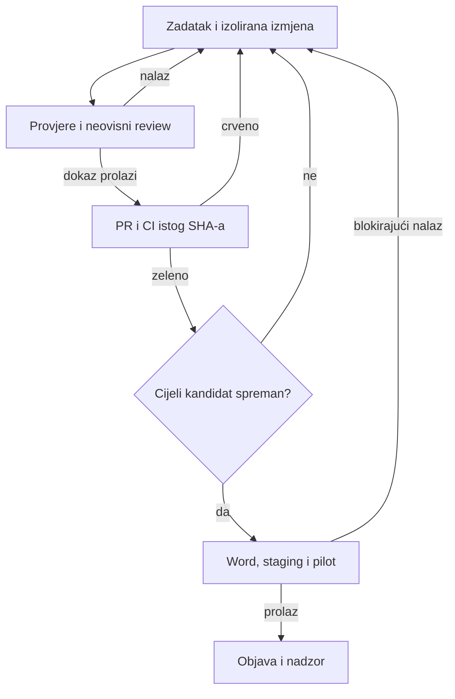

# LEKTA — kompletan plan i program do javnog lansiranja

**Verzija plana:** 1.0 · 12. rujna 2026.  
**Repozitorij:** [danielrisavi77-create/Lekta](https://github.com/danielrisavi77-create/Lekta)  
**Pregledani master:** [`7e52bc66551d7d920ab83810f87f0c52a10f8c16`](https://github.com/danielrisavi77-create/Lekta/commit/7e52bc66551d7d920ab83810f87f0c52a10f8c16), spojen PR #73, 12. 9. 2026. u 15:55 UTC.  
**Cilj:** dovršiti sve postojeće cjeline Lekte, provjeriti ih kroz stvarne korisničke tokove i pripremiti pouzdano javno izdanje. Otvaranje obrta potpuno je izvan opsega ovog plana.

## 1. Zaključak pregleda

Lekta je već velik proizvod s ozbiljnim testovima, pravilima i zaštitama. Ne treba novi frontend framework, novi sustav agenata ni ponovno pisanje cijele aplikacije. Potrebno je zatvoriti razliku između **implementirano u kodu**, **dokazano na reprezentativnim dokumentima** i **ispravno uključeno u produkciji**.

Na pregledanom commitu svih **11 GitHub workflowa završilo je uspješno**. To je dobro polazište za razvoj, ali trenutačno nije dovoljan dokaz spremnosti cijelog proizvoda. Produkcijska verzija nije pouzdano identificirana, dokaz izdanja je zastario, dio Edge koda i podataka nije usklađen s repozitorijem, naplata nije potpuno konfigurirana, a mjerenja stvarnih popravaka traže kvalitetniju neovisnu potvrdu.

**Preporučeni redoslijed:** prvo uspostaviti pouzdano testno okruženje i dokaz verzije; zatim riješiti naplatu, vlasništvo nad dokumentima i oporavak popravaka; usporedno u redoslijedu rada podići kvalitetu pravila i popravaka; dovršiti sve pomoćne cjeline; na kraju provesti pilot, objavu i početni nadzor.

Ovaj program sadrži **32 nova radna paketa, T16–T47**, i dovršavanje već postojećeg **T15 — pilot**. Paketi se razlamaju u male promjene. Postojeći T00–T14 ne ponavljaju se automatski: njihove rezultate treba sačuvati i provjeriti tamo gdje ovise o novim promjenama.

### Što točno znači „cijela aplikacija gotova”

1. Svaka postojeća javna ruta i ponuđena mogućnost ima dovršen glavni tok, prazno stanje, grešku, oporavak i odgovarajuće objašnjenje ograničenja.
2. Sve funkcije namijenjene ovom izdanju povezane su s pregledanim backendom i stvarnom produkcijskom konfiguracijom; uključivanje ne ovisi o postavkama jednog preglednika.
3. Analiza, pravila, plan popravka, izvršeni popravak i završni izvještaj koriste usklađene identifikatore i verzije. Korisnik vidi što je stvarno provjereno i popravljeno.
4. Naplata, prava korištenja, povrat, prijava problema, brisanje i podrška rade od početka do kraja.
5. Tuđi dokumenti i računi nisu dostupni; obrada i rokovi čuvanja odgovaraju onome što aplikacija obećava.
6. Objavljeno izdanje ima svjež dokaz, provjeru u pravom Microsoft Wordu, prolaz stvarnih integracijskih tokova, plan povratka i vlasnika operacija.
7. Pilot je proveden, ozbiljni problemi zatvoreni, a početni nadzor nakon objave ima stvarne rezultate.

**Ne znači:** 407 službeno odobrenih fakulteta, automatsko ispravljanje svake moguće akademske pogreške, jamstvo prolaza na obrani, provjeru plagijata ili pisanje rada umjesto studenta. Lekta ostaje alat za tehničku provjeru i doradu. Ograničenje je valjan dio dovršenog proizvoda kada je precizno, dokazano i vidljivo prije korištenja; samo skrivanje nedovršene postojeće funkcije ne zatvara njezin zadatak u ovom programu.

Nove ideje iz otvorenih PR-ova, poput zasebne desktop aplikacije WordReplica ili velikog novog Academic IR sustava, nisu automatski dio postojećeg proizvoda. Njihove ugovore i dodirne točke treba razriješiti; kompletno razvijanje novih proizvoda nije uvjet dovršavanja Lekte.

## 2. Polazište: provjereno stanje i ograničenja pregleda

Pregled obuhvaća aktualni kod i upute repozitorija, konfiguraciju gradnje i objave, glavne korisničke i serverske tokove, testove i izvještaje, GitHub CI, čitanje metapodataka Supabasea, usporedbu dijela stvarno objavljenog Edge izvornog koda te HTTP smoke test javne stranice. Nije provedena nova potpuna lokalna testna sesija, vizualni pregled svih ekrana, stvarna kupnja, slanje e-pošte niti nova Word provjera. Lokalni skup od 321 dokumenta nije bio dostupan za ponovno mjerenje. Takvi dokazi ostaju konkretne zadaće programa.

### Aktualni nalazi

| Područje | Dokaz na dan pregleda | Posljedica za program |
|---|---|---|
| Arhitektura | Vite, TypeScript, Vitest, Playwright, Deno/Supabase Edge, PostgreSQL, Netlify; paket 2.2.2. Frontend nema React/Next.js. | Raditi unutar postojeće arhitekture. |
| CI na masteru | 11/11 workflowa uspješno na točnom pregledanom SHA-u. | Stare crvene CI nalaze ne prepisivati kao aktualne. |
| Dokaz izdanja | `docs/generated/RELEASE_PROOF.json` odnosi se na `e9dcc52…`, 10. 9.; izračun stanja prema aktualnom kodu daje `stale`. | Obnoviti dokaz tek nakon finalizacije kandidata; `complete: true` sam nije dovoljan. |
| Javni deploy | Smoke: 27 provjera prolazi, ali `/build-info.json` vraća 404. Stroga naredba završava kodom 1. | Ne može se dokazati da javni frontend odgovara pregledanom SHA-u. |
| Produkcijski backend | Produkcija aktivna, staging neaktivan. U repozitoriju 25 Edge ulaznih funkcija, objavljeno 19. | Obnoviti staging i uskladiti manifest, kod, konfiguraciju i uključivanje mogućnosti. |
| Nedostajuće funkcije | `client-error`, `process-bonus-outbox`, `field-render`, `integrity-check`, `preflight-start`, `preflight-result`. | Dio je povijesno namjerno isključen; dovršiti preduvjete, testirati i uključiti. Posebno je važan `client-error`, na koji zadana konfiguracija već upućuje. |
| Razlika izvornog koda | Objavljeni `repair-docx/index.ts` nema aktualni `readFormDataBounded`; razlikuju se i `delete-repair-job/index.ts` te `profile-rules/index.ts`. | Sigurnosni popravak u GitHubu još nije dovoljan ako ga nema na poslužitelju. |
| Granica tog nalaza | `apply-fixers.ts`, `package-integrity.ts` i ulaz `generate-report` podudaraju se nakon normalizacije završetaka redaka. | Nema dokaza da je cijeli repair engine zastario. Uspoređivati sadržaj, ne samo duljinu ili datum. |
| Verzija pravila | Objavljeni server dataset `37cc1b5a…`, repozitorij `8ce3bee1…`; oba s 407 profila. | Jednak broj profila nije jednak skup pravila. Potrebna je provjera hasha i kompatibilnosti klijenta i servera. |
| Migracije | Produkcija ima numerirane migracije 0001–0103 i još četiri vremenski označene migracije drugih cjelina. | Baza je dijeljena. Ne resetirati je niti naslijepo ponavljati povijesne migracije. |
| Konfiguracija ponude | Zadano `enabled: false`; prazni endpointi za izvještaj, checkout, garanciju, preporuke, preflight i field-render. | Dovršiti centralnu konfiguraciju i provjeriti je iz potpuno novog preglednika. |
| Katalog | 23 aktivna proizvoda; 3 pripadaju Katedra/Stripe toku. Svih 20 preostalih Lekta proizvoda nema `mor_product_id`. | Dovršiti mapiranje proizvoda i potvrdu prava nakon naplate. Tri Katedra proizvoda ne računati kao Lemon Squeezy grešku. |
| Nelogičnost ponude | Završni pass: 9,99 € / 180 dana naspram slota do obrane 9,99 € / 120 dana. Diplomski pass: 14,99 € / 180 dana naspram 16,99 € / 120 dana. | Razjasniti razlike ili urediti ponudu; ne predlagati nove cijene bez provjere što svaki SKU uključuje. |
| Sigurnosni advisor | 22 INFO i 67 WARN; u dohvaćenom nalazu nema ERROR. | Ovo nisu 67 potvrđenih ranjivosti. Provjeriti namjeru i dostupnost RLS/RPC pravila prije izmjena. |
| Pozadinski poslovi | 11 aktivnih cron poslova; najnoviji zapisi raspoređivača uspješni. Nema crona za `process-bonus-outbox`. | Uspješan SQL/HTTP raspored nije dokaz dostave poruke ili brisanja objekta. Testirati krajnji učinak. |
| Produkcijski E2E | Postoji test nad `dist/`, ali mockira `profile-rules` i završava u toku planiranja popravka. | Dodati stvarni staging tok kroz backend, naplatu u test modu, popravak i preuzimanje. |
| Ovisnosti | Ratchet bilježi 7 high/critical nalaza punog razvojnog grafa, od toga 1 critical; iznimke istječu 9. 10. 2026. | Ponovno provjeriti identifikatore i izloženost; sanirati ili vremenski ograničiti opravdanu iznimku. |
| Plan razvoja | T00–T14 označeni `done`, T15 `ready`. Postoji autonomni kontroler; konfiguracija je `observe`, publisher isključen. | Ne graditi treći sustav statusa. Pripremiti rad u postojećem sustavu i stvarno provesti pilot. |

Sigurnosni WARN nalazi uključuju `pg_net` u javnoj shemi, dostupnost 13 SECURITY DEFINER funkcija autentificiranim korisnicima, pravila vezana uz anonimnu autentifikaciju i postavku zaštite od kompromitiranih lozinki. Namjerno zatvorene servisne tablice mogu imati RLS bez politika. U T21 provjerava se konkretan pristup i vlasništvo, a ne samo boja advisora. [Supabase: SECURITY DEFINER linter](https://supabase.com/docs/guides/database/database-linter?lint=0029_authenticated_security_definer_function_executable), [RLS bez politika](https://supabase.com/docs/guides/database/database-linter?lint=0008_rls_enabled_no_policy).

### Što mjerenja popravaka trenutačno dokazuju

| Skup / artefakt | Zabilježeno | Kako ga tumačiti |
|---|---|---|
| Povijesno lokalno mjerenje, 10. 9., master `59adbc8c` | 321 dokument; 0 integritetskih kvarova, 0 regresija; 15 `pass`, 304 `review`, 2 `noop`. Od 645 ciljanih nalaza 116 riješeno, 9 automatskih neriješeno, 520 asistiranih neriješeno. | Koristan dokumentirani rezultat, ali nije ponovljen u ovom pregledu. Oko 18% ukupno riješenih ciljeva nije stopa točnosti automatskog popravka. `review` često znači preostali ljudski rad. |
| Neovisnost tog mjerenja | Holdout, izdvojeni skup za završnu provjeru, ima 63 dokumenta; 0/321 neovisno potvrđenih očekivanja. | Treba označiti ispravne i pogrešne primjere neovisno o implementaciji, pa ponovno mjeriti. |
| Trenutačni spremljeni real-corpus artefakt | 7 stvarnih dokumenata; 0 ciljanih provjera; `measuresRepairEffectiveness: false`. | Koristan za očuvanje integriteta/regresije; nije mjera učinkovitosti popravka. |
| Synthetic repair-net | 24 autorska sintetička dokumenta, 14 obuhvaćenih fixera od 31 registriranog. | Proširiti pokrivenost i negativne kontrole. Dva fixera bez promjene u ovom skupu nisu sama po sebi dokaz da su globalno pokvarena. |
| Fakultetski ledger | 436 redaka, 410 različitih oznaka profila; 41 redak s real dokazom, 347 sa sintetičkim, 48 bez izvršenog dokaza. | Ledger ima dodatne retke; ne dijeliti te brojeve sa 407 i ne predstavljati ih kao udio dovršene aplikacije. |
| Registar profila | 407 profila kroz 131 jedinicu u generiranoj matrici. | To su profili/varijante rada, ne 407 fakulteta. |

U ledgeru je 37 redaka klase A, 301 B, 8 C, 42 D i 48 E. Za pravila je 380 redaka označeno verified, 8 bulk-pending, 19 advisory i 29 none. Ti stupci mjere različite stvari. Javni prikaz treba zadržati tu razliku. Potpisana ovjera iz rujna također se ne smije prenijeti na novi skup, commit ili Word verziju bez novog stvarnog izvođenja i odgovarajuće potvrde.

## 3. Arhitektura i opseg koji treba sačuvati

**Klijent:** statički Vite/TypeScript frontend, lokalna DOCX analiza u workeru, lokalno stanje/revizije u IndexedDB-u, učitavanje pojedinačnih pravila na zahtjev.  
**Backend:** Supabase Auth, PostgreSQL/RLS, privatna pohrana, Edge funkcije za popravke, prava, izvještaje i operacije.  
**Vanjske usluge:** Lemon Squeezy za Lekta naplatu, zaseban Katedra/Stripe tok, produkcijski SMTP, Python preflight servis i LibreOffice field-render worker. Njihova aktivna konfiguracija mora se provjeriti.  
**Objava:** Netlify, dokaz točnog izdanja, GitHub provjere i lokalni Windows/Word dokaz.

Dokument u osnovnoj lokalnoj provjeri ostaje u pregledniku. Serverski popravak i dodatne serverske provjere šalju dokument uz objašnjen tok i odgovarajući pristanak. Rečenica „dokument nikad ne napušta uređaj” ne smije opisivati sve mogućnosti aplikacije.

| Cjelina | Uključeno u ovaj program | Radni paketi |
|---|---|---|
| Nova provjera i radni prostor | Učitavanje, profil/program/vrsta rada, rezultat, odabir popravaka, izvršenje, završni dokument i izvještaj | T25–T30 |
| Moji radovi i račun | Lokalni dokumenti, revizije, mentorske zadaće, prijava, povezivanje anonimnog računa, spremljeni serverski popravci | T22, T25, T31, T36 |
| Pravila i dokazi | Svih 407 registriranih profila, službeni izvori, nasljeđivanje, programi, tvrdnje o pokrivenosti | T28, T43 |
| Citati i literatura | Usklađivanje citata i bibliografije, stilovi, pravni izvori, provjera postojanja i jasna ograničenja | T29 |
| Besplatni alati | Citat, citati i literatura, kartice, naslovnica, literatura, izjava; generirane stranice | T32 |
| PDF | Lokalni pregled mogućeg tekstualnog PDF-a i poštena ograničenja; bez izmišljene jednakosti s DOCX analizom | T33 |
| Dodatne provjere | Preflight, integrity, filtriranje po pravu korisnika, vanjski Python servis | T34 |
| Završna obrada | Field-render, osvježavanje polja/TOC-a i dokaz otvaranja u Wordu | T35 |
| Naplata i usluge | Katalog, checkout, webhook, slotovi, passovi, partneri, premium ljudska usluga ako je ponuđena | T23, T24, T38 |
| Povrat i pomoć | Garancija, zahtjev za raskid/povrat, podrška, status zahtjeva | T37 |
| Angažman | Referral, bonus outbox, lista čekanja, rokovi i odjava podsjetnika | T38 |
| Administracija | Prihod, potrošnja, funnel, pokrivenost, operacije, ograničenja pristupa | T39 |
| Katedra | Postojeći handoff, privola, prava, rezultat i završna provjera; bez automatskog prijenosa sirovog rada | T40 |
| Privatnost i sigurnost | RLS/RPC, pohrana, brisanje, korpus, tajne, zlouporaba, ovisnosti | T21, T36, T41 |
| Kvaliteta i operacije | UX, pristupačnost, performanse, SEO, stvarni E2E, monitoring, backup, rollback, troškovni limiti | T19, T42–T47 |
| Razvojni workflow | Postojeći agent runner i autonomni kontroler, jasan red i dokazi | T16, T17 |

## 4. Pravila rada koja vrijede za svaki paket

### Jedan izvor statusa i jedan aktivni pisac

- `docs/agents/development-plan.md` ostaje opis zadataka i kriterija.
- `docs/agents/tasks.json` ostaje kanonski red i status zadataka. Trenutačni validator prihvaća isključivo oblik **T + dvije znamenke**, zato se koriste T16–T47.
- `docs/AUDIT_MASTER.md` ostaje registar potvrđenih nalaza. Dokazi idu uz postojeće kvalitetne izvještaje i u `.artifacts/` gdje im je mjesto; privatni dokumenti ne ulaze u javni repozitorij.
- SQLite kontrolera prati izvršenja, leaseove i pokušaje; ne zamjenjuje poslovno značenje `done` u planu.
- Jedan implementator piše u jednom izoliranom worktreeu izvan glavnog checkouta. Koordinator uređuje red, procjenjuje dokaze i integrira rezultat.
- Na laptopu s 8 GB RAM-a pokretati teške provjere redom. Ne pokretati istodobno nekoliko buildova, cijeli Vitest, više browser matrica i Word.

### Ugovor jednog zadatka

Prije početka koordinator navodi: točan base SHA, reprodukciju problema, cilj, dopuštene datoteke, što nije u tom koraku, ovisnosti, test koji može otkriti stvarnu grešku, kriterij prihvata i rizik objave. Veliki paketi iz nastavka imaju više malih PR-ova; njihov zajednički kriterij mora na kraju proći.

Svaka predaja sadrži: promijenjeno ponašanje, testove koji su stvarno izvedeni, izlazni kod, lokaciju dokaza, neovisni review, preostala ograničenja i sljedeći konkretan korak. Završetak CLI procesa znači `needs_verification`, ne automatski `done`.

Za mali tekstualni ili vizualni popravak ne dodavati besmislene testove koji samo preslikavaju implementaciju. Za parser, naplatu, prava, brisanje i DOCX transformacije zahtijevati relevantne negativne i regresijske slučajeve. Golden rezultate ne obnavljati samo da bi test postao zelen.

### Granice koje se ne zaobilaze

1. Ne mijenjati sadržaj rada izvan jasno dopuštene i odabrane transformacije. Sačuvati vidljivi tekst, slike, formule, fusnote, endnote, komentare i strukturu paketa prema ugovoru pojedinog fixera.
2. Regresija ili integritetski kvar ne prikazuju se kao uspješna isporuka. Original ostaje dostupan.
3. Izvor pravila mora biti službeni ili točno označen kao savjetodavan; ne izmišljati stranicu, citat, službenu naslovnicu ili izjavu.
4. Klijent nije autoritet za cijenu, prava, vlasništvo ili serverske parametre popravka.
5. Produkcijske tajne ne ulaze u frontend, Git, logove agenata ni testne artefakte. Dokumenti korisnika ne idu u AI promptove po zadanim postavkama.
6. Migracije se usklađuju po identitetu i uvode kroz postojeći **`supabase db push`** postupak. Bez resetiranja dijeljene baze i bez zaobilaženja povijesti kroz drugi alat.
7. Obični razvojni CI dokazuje kandidata; javna objava dodatno traži svjež release/Word dokaz. Razlika mora biti eksplicitna, a ne skrivena u različitim varijablama okruženja.
8. Rutinski reverzibilan rad nastavlja se bez stalnog prekidanja vlasnika. Stvarni vanjski trošak, nedostupan račun ili privilegija bilježe se kao konkretna ovisnost; ne zaobilaze se kontrole.

### Izbor agenata bez dodatne potrošnje

Početni put koji je kompatibilan s postojećim runnerom: **Astra koordinira i neovisno pregledava; Sonnet ili Opus implementira preko postojeće pretplate**. U `subscription` profilu Fable je isključen. Trenutačni adapter nema valjan put za Sol implementaciju i Claude review bez Fablea, jer su Claude modeli označeni kao implementatori, a review zahtijeva drugog providera. To se rješava i testira u T17 prije takvog načina rada; ne tvrditi da već radi.

Zadržati početne granice: jedan posao istodobno, najviše tri nova posla dnevno, dva pokušaja po zadatku, najviše dva otvorena autonomna PR-a, čekanje pri iscrpljenoj pretplati, bez automatskog prelaska na API ili dodatne kredite. Automatske male izmjene ograničiti postojećim pravilima opsega; osjetljiv rad ide pregledanim postupkom.

`publisherEnabled` ostaje isključen dok stvarno nije riješeno odvajanje ovlasti pisca i publishera. Samo uklanjanje tokena iz varijabli procesa nije izolacija ako isti OS korisnik i dalje može čitati token iz datoteke. Bez tog uvjeta poluautomatski rad je valjan završeni workflow; nesiguran potpuno automatski deploy nije cilj.

Javni repozitorij može koristiti standardne GitHub-hosted runnere bez naplate izvršavanja, ali veći runneri, proširena pohrana i povezane stavke nisu općenito besplatni. Zadržati `maxPaidActionsUsd: 0`, kratko čuvanje artefakata, bez povećavanja kvota i bez prijenosa cijelog korpusa u Actions. Trošak hostinga, e-pošte i preflight workera evidentirati zasebno; postojeće pretplate za agente ne plaćaju tu infrastrukturu. [GitHub: naplata Actionsa](https://docs.github.com/en/billing/concepts/product-billing/github-actions).

## 5. Program rada i realan raspored

Ovo je procjena opsega, ne obećanje datuma. Za jednog aktivnog implementatora uz AI i neovisni review računati okvirno **35–65 radnih dana**, uz novu procjenu nakon prva tri dana. Potvrđivanje službenih pravila, dostupnost stvarnih dokumenata, vanjski servisi i rezultati pilota mogu produžiti kalendar. Nije opravdano obećati „sve gotovo za sedam dana” na temelju zelenog CI-ja.

| Val | Fokus i redoslijed | Izlazni dokaz | Okvir napora |
|---|---|---|---|
| A | T16, početak T17, T18, T19 | Jedinstven plan, operativni staging, pouzdana gradnja i identitet kandidata | 3–5 dana |
| B | T20–T25, T36, početak T41 | Usklađen backend, račun, katalog, testna kupnja, oporavak bez dvostrukog izvršenja | 7–12 dana |
| C | T26–T29 | Dokazana analiza, učinak popravaka, pokrivenost svih profila i citata | 10–20+ dana |
| D | T30–T35, T37–T40 | Cijelo sučelje i pomoćne/integracijske funkcije dovršene | 8–15 dana |
| E | Završetak T41, T42–T46 | Stvarni E2E, performanse, sigurnost, operacije i kandidat za pilot | 4–7 dana |
| F | T15, T47 | Pilot, sanacije, javna objava i 7 dana početnog nadzora | 3–6 radnih dana, uz protek vremena za promatranje |

Rasponi se dijelom preklapaju kroz istraživanje i čekanje vanjskih ovisnosti; ne zbrajaju se kao precizna ponuda. Pravila/profili mogu biti najduži posao. Najprije potvrditi popularne i zahtjevne obitelji, ali zaključni pregled mora proći svih 407 redaka registra, ne samo nekoliko demonstracijskih fakulteta.

**Kritični put objave:** T18 → T20 → T22/T24 → T25/T27 → T30 → T44 → T46 → T15 → T47. T28, T34/T35 i T45 mogu postati dodatni kritični put ako se pokažu praznine u izvorima, vanjskoj infrastrukturi ili oporavku podataka.

### Prvih deset konkretnih poteza

1. Dohvatiti novi master, zabilježiti SHA i potvrditi je li išta iz ovog audita već riješeno.
2. U postojeći razvojni plan dodati T16–T47; T15 vratiti u `blocked` dok kandidat nije spreman.
3. Popisati svih 25 funkcija, objavljeni sadržaj, konfiguraciju i vanjske ovisnosti u postojeći manifest.
4. Osposobiti staging bez diranja podataka ostalih aplikacija; uvesti samo sintetičke korisnike i dokumente.
5. Popraviti identifikaciju builda i strogu provjeru objavljenog SHA-a.
6. Uskladiti i testirati `repair-docx`, `delete-repair-job`, `profile-rules` i `client-error`; provjeriti hash datasetova.
7. Potvrditi SMTP/auth i anonimni → prijavljeni račun bez gubitka vlasništva.
8. Urediti katalog i provesti prvu cjelovitu testnu kupnju s potvrdom prava preko webhooka.
9. Reproducirati izgubljeni odgovor/proxy grešku tijekom popravka i uvesti pouzdan identitet operacije.
10. Pokrenuti reprezentativno novo mjerenje popravaka s neovisno označenim očekivanjima; prema rezultatu odrediti sljedeće fixere, a ne prema lakoći UI zadataka.

## 6. Izvršivi backlog

**P0** označava sigurnost, podatke, naplatu ili pouzdanost izdanja zbog kojih se objava zaustavlja. **P1** označava dovršenost i kvalitetu potrebnu za cijeli dogovoreni proizvod. P1 ovdje nije sinonim za „ostaviti za poslije”. Ovisnosti znače da završni dokaz paketa mora koristiti dovršene prethodnike; istraživanje i priprema mogu početi ranije.

### T16 — Uspostaviti aktualno polazište i jedinstven plan · P0

**Ovisi o:** T00.  
**Mjesta rada:** `docs/agents/development-plan.md`, `docs/agents/tasks.json`, `docs/AUDIT_MASTER.md`, `docs/agents/autonomy-baseline.md`, `docs/quality/lekta-plan-status.md`.

- [ ] Ponovno provjeriti master, branch protection, otvorene PR-ove i CI na istom SHA-u. Odbaciti nalaze koje noviji kod već pobija.
- [ ] Prenijeti ovaj program u postojeći razvojni plan i dopuniti red T16–T47. Sačuvati povijest T00–T14; T15 povezati s T46 i označiti `blocked`.
- [ ] Za svaku postojeću mogućnost zapisati status koda, integracije, dokaza i objave. Ne izjednačavati te četiri stvari.
- [ ] Otvorene PR-ove svrstati prema tablici u odjeljku 10; izbjeći duplikate i kolizije migracija.
- [ ] Zapisati trajne odluke: ovaj opseg, izvori dokaza, granice automatizacije i odgovorne osobe/uloge.

**Gotovo kada:** validator reda prolazi, nema ciklusa ni dva kanonska statusa, svaki potvrđeni nalaz ima vlasnika i povezani T-zadatak, a stari nalazi nose datum i status. Nema blanket tvrdnje „aplikacija X% gotova”.

### T17 — Dovršiti postojeći workflow agenata · P1

**Ovisi o:** T16.  
**Mjesta rada:** `scripts/agents/core.mjs`, `scripts/agents/cli.mjs`, `scripts/autonomy/`, `config/autonomy.example.json`, `docs/agents/README.md`, `docs/agents/autonomy-runbook.md`.

- [ ] Provjeriti native CLI prijave i pretplatni način rada; prvo izvesti pripremu bez pokretanja modela, zatim jedan mali stvarni zadatak.
- [ ] Uskladiti README, kod i konfiguraciju oko Fablea i neovisnog reviewa. Početni podržani put je Claude implementacija → Astra review. Ako se želi Sol implementacija, prvo dodati valjan Claude reviewer ugovor i testirati odbijanje istog providera.
- [ ] Provjeriti deduplikaciju signala, istek leasea, nastavak nakon pada procesa, najviše dva pokušaja i čekanje pri limitu pretplate. Dokazati da nema prelaska na API ili plaćene kredite.
- [ ] Instalirati postojeći Windows raspored pod odgovarajućim korisnikom, provesti restart računala i najmanje 24 sata/tri stvarna uspješna polla u `observe` načinu. To nije bilo potvrđeno ovim pregledom.
- [ ] Nakon dokaza prijeći na `propose`; `auto_low_risk` samo u postojećim granicama. Odvojiti publisher ovlasti ili ostati u pregledanom poluautomatskom načinu. Sačuvati pauzu, izvještaj i ograničenja.

**Gotovo kada:** mali zadatak prolazi plan → implementacija → neovisni review → dokaz → integracija; ponovno pokretanje ne stvara dupli posao; greška ili limit ne uzrokuju naplatu. Kontroler ne proglašava sam `done` i ne zaobilazi kontrolne datoteke. Dokaz: stvarni izlazi `doctor`, `tick`, `status`, evidencija pokušaja i odgovarajući postojeći testovi kontrolera.

### T18 — Obnoviti staging i urediti migracijsku disciplinu · P0

**Ovisi o:** T16.  
**Mjesta rada:** `supabase/config.toml`, `supabase/migrations/`, `scripts/migration-identity.mjs`, DB smoke skripte, postojeći deploy runbookovi.

- [ ] Osposobiti postojeći staging `bnyemcnsphlitjradrst` i provjeriti njegov stvarni schema/auth/storage status. Produkcija je `zrrjttizjyfcxmcpgzml`.
- [ ] Usporediti identitet migracija s repozitorijem i popisom produkcije. Četiri dodatne migracije drugih cjelina sačuvati; zastarjele upute koje govore da produkcija ima samo pet migracija ispraviti.
- [ ] Napraviti odvojene sintetičke korisnike A/B, proizvode u testnom načinu, privatni testni bucket i anonimizirane ili autorske fixture dokumente. Bez kopiranja stvarnih radova i osobnih podataka radi praktičnosti.
- [ ] Provjeriti redirect URL-ove, CORS, domene, tajne po okruženju i nemogućnost da staging frontend slučajno koristi produkcijsku naplatu ili storage.
- [ ] Izvesti DB smoke i migracijske provjere u namjenskoj testnoj bazi. Evidentirati kako se staging obnavlja nakon pauze; ne prikazivati nedostupnost kao prolaz testa.

**Gotovo kada:** novi testni korisnik može proći auth → pravila → testni popravak → privatno preuzimanje u stagingu, DB provjere prolaze, a manifest jasno razlikuje okruženja. Nema neplanirane promjene produkcijskih podataka. Ako je obnova projekta ograničena računom ili planom, dokumentirati točan blokator i nastaviti ostale nepovezane zadatke.

### T19 — Učiniti gradnju i dokaz izdanja pouzdanima · P0

**Ovisi o:** T16.  
**Mjesta rada:** `scripts/build-production.mjs`, `scripts/write-build-info.mjs`, `scripts/release-check.mjs`, `scripts/release-proof-core.mjs`, `scripts/verify-deploy-dist.mjs`, `scripts/post-deploy-smoke.mjs`, `netlify.toml`, `.github/workflows/`, `playwright.dist.config.ts`.

- [ ] Sačuvati jedan produkcijski lanac gradnje i provjeriti sve generirane stranice, assete i `build-info.json` u stvarnom `dist/`.
- [ ] Razlikovati razvojni CI od release gatea: CI kandidat može nastati prije Word ovjere, ali javni deploy mora zahtijevati svjež dokaz za odgovarajući sadržaj.
- [ ] Dodati negativne slučajeve: nedostajući build-info, pogrešan SHA, stale/unknown dokaz, izmijenjen izvor poslije ovjere, nepotpuna obavezna razina. Svaki mora zaustaviti objavu.
- [ ] Nakon stabilizacije učiniti `ux-dist` obaveznim za release i uskladiti konfiguraciju kontrolera. Trenutačno je opcionalan; postoji sedam obaveznih razina, ne osam.
- [ ] Extraction probe ostaje posebno imenovan sigurnosni dokaz za promjene zaštite pravila i završni kandidat. Ne vraćati ga prešutno u obavezni svaki-build gate ovisan o dostupnosti besplatnog staginga.

**Gotovo kada:** proizvedeni artefakt ima točan identitet, strogi smoke pogrešnu verziju odbija, a dokumentiran je postupak čiste ovjere i naknadnog commita samo proof datoteke. Svjež završni Word dokaz nastaje u T46, nakon svih izmjena.

### T20 — Uskladiti Edge kod, dataset i produkcijsku konfiguraciju · P0

**Ovisi o:** T18, T19.  
**Mjesta rada:** `supabase/deploy-manifest.json`, `supabase/functions/`, `scripts/deploy-drift.mjs`, `scripts/generate-deploy-manifest.mjs`, `src/config/production-config.ts`, `src/config/deployment.ts`, `data/generated/profile-rules-server.json`.

- [ ] Napraviti sadržajnu usporedbu deploya s točnim commitom, uključujući lokalne importove i dataset, uz normalizaciju CRLF/LF gdje je primjerena.
- [ ] U stagingu objaviti aktualni bounded multipart `repair-docx`, brisanje, `profile-rules` i `client-error`; provjeriti krajnji učinak i tek onda planirati produkcijsku promociju.
- [ ] Generirati recipe/server pravila postojećom naredbom, potvrditi digest te klijentsko-serverski ugovor za stabilne check ID-eve i parametre.
- [ ] Definirati pregledanu konfiguraciju okruženja za sve endpointove i feature flagove. Za svaku praznu vrijednost navesti vlasnički paket koji je dovršava; lokalni `?setup=1` nije distribucija produkcijske konfiguracije.
- [ ] Za svih 25 funkcija zapisati JWT/CORS pravila, potrebne tajne bez vrijednosti, ovisnosti, verziju i aktivacijski status. Preflight/renderer/outbox aktiviraju se nakon T34/T35/T38, a ne prije svojih workera.

**Gotovo kada:** potvrđena odstupanja osnovnog backenda nestanu na stagingu, server i klijent koriste isti kompatibilni skup pravila, a svaka preostala aktivacija ima konkretan zadatak. Završna produkcijska jednakost ponovno se provjerava u T47.

### T21 — Zatvoriti stvarne sigurnosne i autorizacijske rizike · P0

**Ovisi o:** T18, T20.  
**Mjesta rada:** `supabase/migrations/`, `supabase/functions/_shared/`, svi javni Edge ulazi, auth/RLS/RPC testovi i postojeće security provjere.

- [ ] Za svaku dostupnu tablicu, RPC i bucket provjeriti korisnika A, korisnika B, neprijavljenog korisnika i servisni identitet. Pokriti read/write/delete, popis, potpisani URL, RPC parametre i administraciju.
- [ ] Razvrstati 22 INFO i 67 WARN na namjerno stanje, stvarni problem i potrebnu dodatnu provjeru. Posebno provjeriti `auth.uid()`, vlasništvo, `search_path`, execute privilegije i SECURITY DEFINER.
- [ ] Na svakom uploadu dokazati ograničenje cijelog zahtjeva prije parsiranja, ograničenje raspakiranog ZIP-a/XML-a, timeouta i memorije. Obraditi pokvareni ZIP, ZIP bombu, vanjske XML reference, path traversal, nedopušteni format i pretjerani broj dijelova.
- [ ] Provjeriti CORS allowlist, JWT ugovore, javne anonimne endpointove, rate limitove, izvorni IP iza proxyja, sanitizaciju HTML-a i logove. Javni endpoint bez JWT-a nije automatski ranjivost; mora imati primjerenu zaštitu za svoju svrhu.
- [ ] Potvrditi zaštitu javnog bundlea i privatnih pravila postojećim canary/extraction testovima. Sigurnosne probe koje stvaraju promet izvoditi na stagingu s namjenskim računima.

**Gotovo kada:** nema potvrđenog čitanja/mutacije tuđih podataka, zaobilaska prava ili neograničene obrade; relevantni negativni testovi padaju pri namjerno uklonjenoj zaštiti. Advisor iznimke imaju objašnjenje i vlasnika. Promjene ne otvaraju servisne tablice radi uklanjanja upozorenja.

### T22 — Dovršiti račun, prijavu i e-poštu · P0

**Ovisi o:** T18, T20, T21.  
**Mjesta rada:** `src/auth/session.ts`, račun u `src/routes/my-work/`, pripadajući UI, Supabase Auth postavke i email predlošci.

- [ ] Provjeriti anonimnu sesiju, povezivanje e-pošte uz očuvanje istog korisnika i vlasništva, OTP/magic link, istekao ili ponovno korišten link, postavljanje/obnovu lozinke i odjavu.
- [ ] Potvrditi ponašanje nakon reloada, osvježavanja tokena, promjene uređaja i prolaznog mrežnog kvara. Privremeni kvar osvježavanja ne smije izbrisati valjanu lokalnu sesiju ni dokument.
- [ ] Konfigurirati i testirati produkcijski SMTP s verificiranom domenom/predlošcima, ispravnim povratnim URL-ovima i kontroliranim rate limitovima. Stanje SMTP-a nije potvrđeno ovim auditom.
- [ ] Testirati link otvoren u drugom pregledniku, dvojni klik, postojeću e-poštu na drugom računu i oporavak bez tihog premještanja tuđih prava.
- [ ] Korisniku jasno prikazati razliku između lokalnog rada i serverskih podataka računa; ponuditi razumljivu pomoć pri neuspjeloj prijavi.

**Gotovo kada:** stvarne testne poruke stižu na namjenske adrese, sve sesijske grane daju očekivani rezultat, a anonimni korisnik nakon registracije zadržava vlastiti rad i pripadajuća prava. Supabaseov zadani SMTP nije namijenjen produkcijskoj dostavi; ne pretpostavljati da uredan auth API znači da će student primiti poruku. [Supabase: vlastiti SMTP](https://supabase.com/docs/guides/auth/auth-smtp).

### T23 — Urediti katalog, cijene i prava proizvoda · P0

**Ovisi o:** T16.  
**Mjesta rada:** `src/catalog/products-catalog.ts`, `src/report/pricing.ts`, `src/report/slot-logic.ts`, tablica `products`, postojeći RPC za promjenu cijene i povijest cijena.

- [ ] Popisati svih 23 aktivna proizvoda i odvojiti 20 Lekta od tri Katedra proizvoda. Za svaki zapisati cijenu, valutu, porezni prikaz, broj dokumenata, rok kupnje/aktivacije, rok slota, bonus i isporuku.
- [ ] Razriješiti prividno dominirane završne/diplomske ponude: utvrditi postoji li stvarna dodatna korist. Ako ne postoji, pojednostaviti prikaz/katalog uz očuvanje već kupljenih prava.
- [ ] Dovršiti ispravna MoR mapiranja, uključujući identifikatore proizvoda/varijanti koje koristi stvarni checkout kod. Testne i produkcijske vrijednosti ne miješati.
- [ ] Uskladiti kartice cijena, opis isporuke, checkout i račun. Cijena i pravo dolaze iz serverskog autoriteta, ne iz parametra preglednika.
- [ ] Definirati postupak atomarne promjene cijene i audit zapisa; ukloniti prodaju nepostojeće ili operativno neizvedive usluge prije uključivanja.

**Gotovo kada:** svaki ponuđeni SKU ima jednoznačno objašnjenje i mapiranje, test potvrđuje stvarnu cijenu i prava, a stara kupnja ostaje ispravno prepoznata nakon promjene kataloga. Nove cijene ne izmišljati kao dio tehničke sanacije.

### T24 — Završiti checkout, webhook i životni ciklus prava · P0

**Ovisi o:** T20, T22, T23.  
**Mjesta rada:** `supabase/functions/create-checkout/`, `supabase/functions/webhook-mor/`, `src/report/checkout.ts`, `src/report/webhook.ts`, slot/RPC migracije i testovi.

- [ ] Provesti testnu kupnju od javnog gumba do serverski potvrđenog prava. Povrat na „uspjeh” stranicu sam ne smije dodjeljivati kupljeno pravo.
- [ ] Provjeriti potpis nad izvornim tijelom webhooka, pogrešan potpis, pogrešan proizvod/iznos/valutu, ponovljeni događaj, događaje izvan redoslijeda i zakašnjeli webhook.
- [ ] Provjeriti atomarnu dodjelu i potrošnju slota, istek, pass, ponovno korištenje istog dokumenta, konkurentne zahtjeve te isti event dostavljen više puta.
- [ ] Uskladiti refund/chargeback/otkaz s pravima, poviješću i obavijesti korisniku. Dodati vidljiv status „naplata zaprimljena, potvrda u tijeku” i operativnu provjeru zaglavljenih narudžbi.
- [ ] Dovršiti testni način sada; pri završnoj aktivaciji provjeriti stvarni račun i tajne providera. Vanjsku nedostupnu aktivaciju evidentirati bez proglašavanja neizvedene transakcije uspješnom.

**Gotovo kada:** svaka namjenska testna kupnja završava točno jednim odgovarajućim pravom; ponovljeni događaj ne daje dodatno pravo; greške imaju oporavak i operativni trag. Nema stvarnih troškova samo radi automatiziranog testa.

### T25 — Učiniti popravak i ponavljanje zahtjeva pouzdanima · P0

**Ovisi o:** T20, T21, T24.  
**Mjesta rada:** `src/repair/workflow-controller.ts`, `src/repair/recovery-policy.ts`, `src/report/repair-client.ts`, repair history, `supabase/functions/repair-docx/`, `supabase/functions/delete-repair-job/`, pripadajuće DB/RPC promjene.

- [ ] Reproducirati slučaj u kojem server obradi zahtjev, ali klijent izgubi odgovor, dobije proxy 502/504 ili korisnik zatvori karticu. Trenutačni oporavak smatra HTTP odgovor sigurnim za retry; to nije dovoljan dokaz da posao nije izvršen.
- [ ] Uvesti ili dosljedno upotrijebiti trajan identitet operacije prije naplatnog/izvršnog učinka, vezan uz vlasnika, dokument, verziju pravila i odabrani plan. Definirati trajanje, konkurentne pozive i ponovni dohvat ishoda.
- [ ] Povezati transakcijsko rezerviranje/potrošnju prava s operacijom; sačuvati postojeću zaštitu fingerprinta i atomarnu potrošnju. Ovim auditom nije dokazano dvostruko terećenje, nego nedovoljan ugovor za nepoznat ishod.
- [ ] Povezati UI s provjerom stvarnog statusa. Nepostojanje retka u povijesti dok traje asinkrona pohrana nije konačan dokaz da se ništa nije dogodilo.
- [ ] Dovršiti preuzimanje, istjecanje poveznice, ponovni pristup, otkaz/grešku pohrane i brisanje. Odabir i aktivni dokument ne smiju se zamijeniti kasnim odgovorom drugog zahtjeva.

**Gotovo kada:** dvostruki klik, refresh, paralelni poziv i izgubljeni odgovor daju jedan definiran posao i očekivanu potrošnju prava; isti posao je ponovno dohvatljiv. Korisnik nikad ne dobiva savjet da slijepo pokrene novu naplativu obradu.

### T26 — Potvrditi točnost lokalne analize DOCX-a · P1

**Ovisi o:** T16.  
**Mjesta rada:** `src/analysis/`, `src/docx/parser.ts`, `src/scoring/evaluate/`, `src/preview/`, parser/conformance fixture i testovi.

- [ ] Napraviti tablicu podržanih svojstava: sekcije, margine, stilovi i nasljeđivanje, direktno formatiranje, prored, poravnanje, naslovi, tablice, zaglavlja/podnožja, fusnote/endnote, brojanje i bibliografija.
- [ ] Za svaku rizičnu obitelj dodati poznato ispravan i poznato pogrešan primjer s očekivanjem neovisnim o parseru. Pokriti nekoliko Word/LibreOffice izvora, lokalizacije i prazne rubne dijelove.
- [ ] Uskladiti ono što analiza mjeri s onim što pravilo tvrdi. Nepouzdano ili nemjerljivo svojstvo mora biti `unknown`/ručna provjera, a ne izmišljeni prolaz/pad.
- [ ] Provjeriti worker otkazivanje, progres, veliki dokument, zastarjeli rezultat nakon promjene rada i obradu neispravnog DOCX-a bez zamrzavanja stranice.
- [ ] Golden promjene vezati uz dokaz stvarnog Word ponašanja, uz zaseban adversarijalni pregled za parser/citate.

**Gotovo kada:** reprezentativna matrica mjerenja i conformance prolaze, nema sustavnog lažno pozitivnog nalaza na poznato ispravnim dokumentima, a nemjerljive stavke jasno su označene. Veličina i vrijeme obrade imaju izmjerene granice.

### T27 — Dokazati i poboljšati svih 31 fixera · P0

**Ovisi o:** T25, T26.  
**Mjesta rada:** `src/repair/`, `scripts/corpus-gen/repair-net.mts`, `scripts/repair-real-corpus.mts`, `docs/quality/real-corpus-protocol.md`, `data/verification/`, pripadajući testovi.

- [ ] Za svih 31 registriranih fixera zapisati ulazne pretpostavke, automatski/asistirani/dispatch način, potrebne parametre, ciljane check ID-eve, dopuštene izmjene i razlog preskakanja.
- [ ] Proširiti sintetičku mrežu na svaku obitelj, uključujući negativne kontrole. Posebno istražiti `citation-bibliography-sync-fixer` i `consistency-fixer`, koji u sadašnjem skupu nisu napravili promjenu, bez preuranjenog zaključka da su pokvareni.
- [ ] Dovršiti neriješene automatske slučajeve iz stvarnog mjerenja, uključujući `footnote.format`, `format.justify.body` i `format.spacing.body`. Asistirane slučajeve mjeriti tek kad imaju valjane, svjesno potvrđene parametre.
- [ ] Uspostaviti reprezentativan neovisan holdout s očekivanjima `expectedBy`/`expectedAt`; odvojiti razvojne dokumente, vlastite sintetike i stvarne dopuštene dokumente. Sačuvati provenijenciju i hashove bez objave privatnog sadržaja.
- [ ] Izvesti dva stvarna uzastopna popravka radi idempotentnosti, ponovno analizirati rezultat, provjeriti regresije i integritet paketa, zatim otvoriti popravljen rezultat u Wordu prije i nakon ažuriranja polja.

**Gotovo kada:** svaki fixer ima pozitivan i negativan dokaz, sva neočekivana oštećenja/promjene sadržaja i lažno prikazani uspjesi su nula, a poznati automatski kvarovi su riješeni. Izvještaj odvojeno pokazuje razriješene, neriješene, preskočene, neprimjenjive i ručne stavke te točne nazivnike. Jedan agregatni postotak ili velik broj dokumenata bez očekivanja nije dovoljan release kriterij.

### T28 — Završiti registre pravila, programa i dokaza za svih 407 profila · P1

**Ovisi o:** T16, T26.  
**Mjesta rada:** `data/profiles/`, registri izvora/programa, `src/profiles/`, `src/programs/`, `src/ui/profile-claim.ts`, generator completion-ledgera i faculty-matrice.

- [ ] Proći svih 407 registriranih profila: institucija/jedinica, program, vrsta rada, verzija pravila, službeni izvor, opseg, datum i kompatibilnost. Razriješiti dodatne ledger retke i razliku između 407/410/436.
- [ ] Ispraviti tri rute programa bez profila: `fpzg-ba-vvu`, `fpzg-joint-se`, `pravo-joint-repic`; potvrditi pravi tip rada, ne dodijeliti nasumičan profil.
- [ ] Za pending/advisory/none pravila pribaviti službeni izvor ili točno dokumentirati da službena odredba nije dostupna. Za svaki automatski primijenjeni zahtjev sačuvati izvor, stranicu ako postoji, formulaciju, obveznost, opseg i hash.
- [ ] Dovršiti nasljeđivanje i dokaze po obiteljima; razlikovati izravni real dokaz, dokaz rada iste jedinice, sintetički dokaz i neprovjereno. Generički profil ne prikazivati kao potpunu službenu potvrdu.
- [ ] Provjeriti naslovnice, citatne stilove i izjave: ledger trenutačno ima 209 redaka s točnim naslovnicama, 246 sa službenim citatnim izvorom i 48 sa službenom izjavom. To nisu jednaki nazivnici niti dopuštenje za izmišljanje ostalih.

**Gotovo kada:** nema zapisa bez razriješenog statusa, nevažećeg mapiranja ili prikrivenog nasljeđivanja; tvrdnja u izboru profila, rezultatima i javnoj stranici ista je i dokaziva. Ako ustanova ne objavljuje određeno pravilo, dovršetak je točno dokumentirano ograničenje, a ne fabricirana službena norma.

### T29 — Dovršiti citate, literaturu i provjeru izvora · P1

**Ovisi o:** T26, T28.  
**Mjesta rada:** `src/citations/`, `src/repair/` citatni fixeri, `supabase/functions/source-check/`, pripadajući alati i citation dossier skripte.

- [ ] Pokriti stilove koji se stvarno nude, uključujući pravne izvore, autor-godina, više autora, organizacije, bez datuma, istog autora iste godine, DOI/URL i lokalizirane interpunkcijske slučajeve.
- [ ] Provjeriti citat → bibliografija i bibliografija → citat bez zahtjeva da se svaka stavka mora pojaviti u tekstu kad službeni stil to ne traži. Pokriti fusnote/endnote i dijelove koje parser ne može pouzdano klasificirati.
- [ ] Provjeru postojanja izvora odvojiti od provjere istinitosti navoda, valjanosti cijelog rada i plagijata. Timeout, rate limit ili izostanak odgovora vanjskog registra nije dokaz da je izvor izmišljen.
- [ ] Sanitizirati tekst/URL-ove, ograničiti vanjske zahtjeve i spremanje; spriječiti SSRF ako server dohvaća korisnički URL. Dopustiti samo provjerene transformacije bibliografije uz pregled korisnika.
- [ ] Izvesti nezavisan review nejasnih parser slučajeva i idempotentnost svakog citatnog fixera.

**Gotovo kada:** poznato ispravni i pogrešni primjeri imaju točan rezultat, servisi u kvaru daju `unknown` uz oporavak, a korisniku se ne mijenja sadržaj reference na temelju nepouzdanog podudaranja.

### T30 — Dovršiti glavni korisnički tok · P1

**Ovisi o:** T22, T25, T27, T28.  
**Mjesta rada:** `src/routes/intake/`, `src/routes/workspace/`, `src/ui/repair-panel.ts`, `src/ui/repair-workflow-binding.ts`, `src/ui/results/`, `src/repair/workflow-controller.ts`, `src/report/report.ts`, `supabase/functions/generate-report/`.

- [ ] Proći tok od `/` kroz učitavanje, profil i analizu do `/rad/`, plana, parametara, izvršenja, provjere i preuzimanja. Sačuvati već implementirane T02–T14 komponente.
- [ ] Uskladiti odabir nalaza i opcija u svim panelima s jednim kontrolerom; onemogućiti proturječno stanje, dvostruki start i kasni odgovor za prethodni dokument.
- [ ] Prikazati korist prije naplate, što će se promijeniti, što traži podatke korisnika, što ostaje ručno i kada dokument ide na server. „Gotovo” mora odražavati provjereni ishod.
- [ ] Dovršiti i zaseban tok generiranja izvještaja: provjera prava, točan dokument/profil/verzija, rezultat i isporuka. Provjeriti prazan ili neuspješan izvještaj, ponavljanje i pristup krivog korisnika.
- [ ] Dovršiti prazna stanja, loš format, nedostupna pravila, offline, djelomičan uspjeh, istek sesije, povratak na original i podršku. Opći fallback jasno označiti; ne računati rezultat prema nepotpunom stubu pravila.
- [ ] Provjeriti desktop i mobitel: vidljiv glavni gumb, dijalozi, scroll, fokus tipkovnice, pomoćni tekst, progres i povratak nakon navigacije.

**Gotovo kada:** novi korisnik bez objašnjenja autora razumije sljedeću radnju i može završiti tok; svi prikazani ishodi odgovaraju backend/verification stanju. Dokaz su stvarni korisnički scenariji i screenshotovi relevantnih stanja, uz UX testove postojećih regresija.

### T31 — Završiti Moje radove, revizije i mentorske zadaće · P1

**Ovisi o:** T25, T30.  
**Mjesta rada:** `src/routes/my-work/`, `src/routes/workspace/revisions.ts`, `src/session/`, `src/history/`, `src/mentor/`, `src/ui/results/`.

- [ ] Provjeriti novi dokument, ponovno otvaranje, promjenu naziva, zamjenu revizije, brisanje i ograničenje lokalne pohrane. Obraditi IndexedDB migraciju, quota grešku, privatno pregledavanje i čišćenje browser podataka.
- [ ] Odvojiti lokalne dokumente od serverski spremljenih popravaka; ne obećavati sinkronizaciju sirovog dokumenta među uređajima ako nije implementirana.
- [ ] Usporedbu revizija vezati uz stabilan identitet nalaza, profil i verziju pravila; promjena programa ne smije proizvesti lažni prikaz da je isti nalaz riješen.
- [ ] Mentorske komentare/zadaće povezati s odgovarajućim radom i revizijom, uz status i korisnikovu potvrdu. Označavanje zadaće dovršenom nije dokaz da je tehnički nalaz prošao provjeru.
- [ ] Pokriti dva taba, osvježavanje usred rada, dokument s istim imenom ali drugim sadržajem i sesiju koja istekne tijekom preuzimanja.

**Gotovo kada:** revizije i zadaće ne prelaze na krivi rad, lokalni životni ciklus ne gubi podatke bez upozorenja, a korisnik može pronaći i obrisati sve što aplikacija tvrdi da je spremila.

### T32 — Dovršiti sve besplatne alate i generirane dokumente · P1

**Ovisi o:** T28, T29.  
**Mjesta rada:** `src/tools/`, `src/title-pages/`, `src/declarations/`, `scripts/generate-citation-tools.mjs`, `scripts/generate-title-page-tools.mjs`, HTML ulazi alata.

- [ ] Proći `/alati.html`, `/citat.html`, `/citati-i-literatura.html`, `/kartice.html`, `/naslovnica.html`, `/literatura.html` i `/izjava.html`: unos, primjer, reset, validacija, kopiranje i postojeći izvoz/preuzimanje.
- [ ] Za naslovnicu i izjavu upotrijebiti službeni predložak gdje postoji; u ostalim slučajevima jasno prikazati generički predložak i podatke koje korisnik treba provjeriti.
- [ ] Provjeriti hrvatska slova, duge naslove i imena, više mentora gdje je podržano, godine/datume, prazna polja i tip rada. Korisnički unos sigurno prikazati i u HTML-u i u generiranom dokumentu.
- [ ] Uskladiti podatke profila i prikaz tvrdnji s glavnom aplikacijom. Zajedničke citatne i bibliografske funkcije ne duplicirati s drukčijim pravilima.
- [ ] Svaki generirani DOCX otvoriti provjerama paketa i reprezentativno u Wordu; provjeriti izgled naslovnice/izjave, ne samo postojanje datoteke.

**Gotovo kada:** svaki javno naveden alat ima funkcionalan izlaz, radi na mobitelu i s tipkovnicom, ne gubi unesene podatke pri očekivanoj radnji te ne tvrdi da je generički izlaz službeno odobren.

### T33 — Dovršiti PDF tok s točnim granicama · P1

**Ovisi o:** T26, T30.  
**Mjesta rada:** `src/pdf/pdf-preflight.ts`, intake/workspace integracija i PDF testovi.

- [ ] Potvrditi što se mjeri iz tekstualnog PDF-a i što se ne može dokazati bez Word strukture. Uskladiti naziv funkcije, rezultat i javno objašnjenje.
- [ ] Testirati skenirani PDF bez teksta, šifrirani PDF, pokvarenu datoteku, više stupaca, formule, nepravilne fontove i veliki dokument.
- [ ] Uskladiti ograničenje veličine s UI-jem i stvarnim parserom. Trenutačna ograničenja pojedinih DOCX/PDF/preflight tokova razlikuju se; prikaz mora pratiti konkretan put.
- [ ] Obradu izvesti bez blokiranja UI-ja; omogućiti prekid i razumljivu preporuku za DOCX kada je potreban stvarni tehnički popravak.

**Gotovo kada:** tekstualni PDF daje reproducibilan ograničen rezultat, nepodržani ulazi ne dobivaju lažno preciznu ocjenu, a PDF tok ne obećava automatski DOCX popravak niti nepostojeći OCR.

### T34 — Završiti preflight i integrity sa stvarnim servisom · P1

**Ovisi o:** T20, T21, T22, T29, T36.  
**Mjesta rada:** `src/preflight/`, `src/integrity/`, `supabase/functions/preflight-start/`, `preflight-result/`, `integrity-check/`, `docs/deploy/PREFLIGHT_DEPLOY.md`; vanjski Python servis prema stvarnom repozitoriju.

- [ ] Pronaći aktualni izvor i deploy vanjskog servisa. Runbook navodi `lekta-pipeline`, ali dohvat `danielrisavi77-create/lekta-pipeline` ovim pristupom vraća 404; to može značiti nedostupnost ili drugo mjesto repozitorija. Kod i aktivni servis zato nisu potvrđeni.
- [ ] Revidirati ugovor: meta + privola/JWT → kratkotrajni upload token → izravan HTTPS upload → status posla → filtrirani rezultat. Provjeriti potpis, istek, replay, vlasništvo i granice zahtjeva na obje strane.
- [ ] Potvrditi javni HTTPS, dozvoljene origine/CSP, health, timeout, memorijske/CPU limite, privremene datoteke i čišćenje. Pokretanje pripremiti na postojećem odgovarajućem hostu, bez zahtjeva da laptop dobije Docker/WSL/admin prava.
- [ ] U stagingu uključiti sve podržane module i dokazati da filtriranje prava radi na serveru. Niži paket ne smije dobiti puni skriveni izvještaj pa ga samo sakriti u UI-ju.
- [ ] Dokumentirati granice integritetske provjere. M4/full-text korpus ovisi o stvarno dostupnom i dopuštenom indeksu; bez njega taj se dokaz ne izmišlja niti oglašava kao provjera plagijata.
- [ ] Testirati kill switch, kvote, neuspjeli upload, pad workera, istek rezultata i korisnički oporavak; zatim povezati pregledanu produkcijsku konfiguraciju.

**Gotovo kada:** stvaran testni dokument prolazi cijeli put do ispravno filtriranog rezultata, pogrešne ovlasti/tokeni se odbijaju, a dokument i privremeni sadržaj brišu se prema ugovoru. Nedostupan izvor ili host ostaje vidljiv blokator ove funkcije, ne lažni status `done`.

### T35 — Dovršiti field-render i završni dokument za predaju · P1

**Ovisi o:** T20, T27.  
**Mjesta rada:** `workers/field-renderer/`, `supabase/functions/field-render/`, klijentski poziv rendereru, `scripts/word-verify/`, `scripts/verify-docx/`.

- [ ] Provjeriti ugovor Edge → worker: autentifikacija, dopušteni format, ukupna veličina, raspakiravanje, timeout, broj istodobnih obrada i sigurno čišćenje procesa/datoteka.
- [ ] Objaviti testni worker na odgovarajućem hostu i dokazati stvarni poziv s dokumentom. Dockerfile u repozitoriju nije dokaz da servis radi.
- [ ] Usporediti sadržaj i raspored prije i nakon osvježavanja polja/TOC-a. Posebno pokriti numeraciju stranica, više sekcija, slike, jednadžbe, reference i dugačke radove.
- [ ] Zadržati original i prethodno provjereni DOCX kada renderer zakaže ili uvede regresiju. Korisniku dati točnu Word uputu za ručno osvježavanje polja kada je to predviđeni rezervni tok.
- [ ] Izvesti obavezne provjere u stvarnom Microsoft Wordu na Windowsu. LibreOffice izlaz i XML validacija nisu zamjena za Word dokaz. PR #38 razriješiti kao zaseban ugovor, ne kao gotovu desktop aplikaciju.

**Gotovo kada:** korisnik dobiva provjeren konačni dokument i razumljiv status polja, worker se oporavlja od lošeg ulaza, a dokaz uključuje stvarno otvaranje popravljenog izlaza prije i nakon ažuriranja polja.

### T36 — Završiti privatnost, brisanje i životni ciklus podataka · P0

**Ovisi o:** T21, T22, T25.  
**Mjesta rada:** `src/legal/`, `src/session/`, `src/corpus/`, `supabase/functions/delete-repair-job/`, `cleanup-orphan-repairs/`, `withdraw-corpus-contribution/`, purge migracije i pripadajuća UI dokumentacija.

- [ ] Napraviti kartu stvarnih podataka: lokalni rad/revizije, serverski dokumenti, job metapodaci, rezultati, analitika, client errors, e-pošta, narudžbe, privole i korpus. Za svaki zapisati svrhu, mjesto, pristup, rok i način brisanja.
- [ ] Uskladiti tekst prije uploada, stranice privatnosti i stvarni promet. Opcionalni doprinos korpusu mora biti odvojen, razumljiv i dokaziv; ne stavljati cijeli dokument u analitički ili integracijski payload.
- [ ] Provjeriti ručno brisanje rada, povlačenje doprinosa, brisanje računa, istek roka i orphan cleanup na stvarnim testnim objektima. Ako brisanje računa nije dovršeno, implementirati ga s odgovarajućom serverskom autorizacijom i evidencijom potrebnih iznimki.
- [ ] Dokazati da stara preuzimanja, potpisani URL-ovi, privremene kopije i sekundarni rezultati više ne daju pristup nakon predviđenog roka. Korisniku ne obećavati trenutačno brisanje iz sigurnosnih kopija ako se provodi kroz definirani ciklus.
- [ ] Odvojiti sintetički testni korpus, stvarne radove uz valjano dopuštenje i vanjske izvore/indekse s njihovim pravima uporabe. Ne prenositi dopuštenje za jedan cilj automatski na treniranje ili javnu objavu.
- [ ] Provjeriti stvarne cookies/storage/analytics tehnologije i potrebne kontrole, bez generičkog bannera koji ne odgovara implementaciji.

**Gotovo kada:** svaki obećani rok i brisanje imaju dokaz na objektu i metapodacima, korisnik ima funkcionalnu kontrolu svojih podataka, a e-pošta, nazivi dokumenata i tekst rada ne završavaju u nepotrebnim logovima. Rokove nužnih transakcijskih evidencija uskladiti s primjenjivim obvezama bez brisanja naslijepo.

### T37 — Dovršiti garanciju, povrat/raskid i podršku · P1

**Ovisi o:** T22, T24, T36.  
**Mjesta rada:** `src/report/guarantee.ts`, `src/legal/`, `supabase/functions/file-guarantee-claim/`, javne stranice uvjeta/garancije, odgovarajući admin tok; pregledati PR #29.

- [ ] Povezati zahtjev s narudžbom, korisnikom i relevantnim dokazom; dati potvrdu primitka, vidljiv status i kanal odgovora. Dokument ne tražiti kada su metapodaci dovoljni.
- [ ] Dovršiti zahtjev za raskid/povrat od obrasca do operativne obrade i MoR evidencije. Predložena `withdrawal_requests` tablica nije pronađena u produkciji; sama migracija iz PR-a ne čini cijeli tok.
- [ ] Uskladiti garanciju sa stvarnom pokrivenošću i granicama proizvoda. Izbjegavati jamstvo ishoda obrane ili tvrdnju da su sve stavke automatski popravljive.
- [ ] Napraviti predloške odgovora za nedostavljen rezultat, dvostruku narudžbu, pogrešno pravo, nezadovoljstvo popravkom i brisanje. Definirati vlasnika i interni cilj prvog odgovora: jedan radni dan tijekom lansiranja.
- [ ] Provjeriti klasifikaciju ponuđene digitalne usluge/sadržaja i primjenjiva prava s MoR tokom. Ne pretpostavljati da jedan checkbox univerzalno isključuje pravo na povrat.

**Gotovo kada:** testni zahtjev prolazi podnošenje → potvrda → admin obrada → razrješenje → obavijest korisniku, uz autorizaciju i trag promjena.

Za dizajn ovog toka relevantne su izmjene hrvatskog Zakona iz NN 59/2026: članak 28 uvodi članak 81.a o funkciji za jednostrani raskid putem mrežnog sučelja, potvrdi podnošenja i potvrdi primitka na trajnom mediju. Tehnički tok pripremiti, a primjenjivost na pojedini proizvod i iznimke provjeriti prema aktualnom ugovoru i pravilima; ovaj plan ne zamjenjuje pravnu klasifikaciju proizvoda. [Narodne novine: izmjene Zakona o zaštiti potrošača](https://narodne-novine.nn.hr/clanci/sluzbeni/2026_06_59_728.html).

### T38 — Dovršiti preporuke, bonuse, podsjetnike i ponuđene usluge · P1

**Ovisi o:** T22, T24, T36.  
**Mjesta rada:** `src/referral/`, `src/waitlist/`, `src/submission/`, `src/report/referral.ts`, `src/report/partner.ts`, `supabase/functions/redeem-referral-signup/`, `process-bonus-outbox/`, `faculty-request/`, `send-reminders/`, `unsubscribe-reminder/`.

- [ ] Referral provjeriti od linka do uvjeta dodjele bonusa: vlasništvo, samopreporuka, dupli signup, ponovljeni webhook, više tabova i zlouporaba. Dodjela mora biti idempotentna.
- [ ] Objaviti i rasporediti `process-bonus-outbox` s ograničenim pokušajima, razmakom ponavljanja, terminalnim neuspjehom i admin signalom. Dokazati stvarnu dodjelu, ne samo uspješan cron SQL.
- [ ] Provjeriti zahtjev za fakultet i potvrdu interesa bez duplikata/nepotrebnih osobnih podataka. Obavijest o novoj pokrivenosti šalje se samo uz odgovarajuću dozvolu i stvarno ažurirano pravilo.
- [ ] Dovršiti rokove, vremenske zone, podsjetnike, odjavu i provjeru neispravnog/ponovno korištenog tokena. Rok mora pripadati točnom programu/vrsti rada i akademskoj godini, uz aktualni potvrđeni izvor. Testne poruke slati samo namjenskim primateljima.
- [ ] Za partnerske pakete definirati vlasnika kupnje, raspodjelu prava i izolaciju dokumenata. Za postojeći `premium_human` definirati stvarnu osobu/kapacitet, rok, ulaz, izlaz i status isporuke; automatizirani placeholder nije isporučena ljudska usluga.

**Gotovo kada:** svaka ponuđena pogodnost ili usluga ima cijeli isporučivi tok, obračun i podršku. Bonus se dodijeli jednom, odjava zaustavlja buduće podsjetnike, a korisnik vidi odgovara li paket njegovu slučaju.

### T39 — Dovršiti administraciju i operativni pregled · P1

**Ovisi o:** T20, T24, T25, T37, T38.  
**Mjesta rada:** `src/admin/`, `supabase/functions/admin-stats/`, povezani admin RPC-ovi.

- [ ] Provjeriti serversku administratorsku autorizaciju na svakom podatku i radnji; skriven gumb i client allowlist nisu dovoljni. Obični prijavljeni i anonimni korisnik moraju biti odbijeni.
- [ ] Uskladiti prihod, refund, broj narudžbi, dodijeljena/potrošena prava, status popravaka i outbox s izvorom istine. Jasno prikazati valutu, vremensku zonu i definiciju metrike.
- [ ] Dovršiti prazne/djelomične podatke, nedostupan backend i filtriranje razdoblja. Broj 0 ne smije prikrivati grešku dohvaćanja.
- [ ] Omogućiti operativno razrješavanje postojećih tokova: zaglavljena narudžba, kvar popravka, povrat/garancija, nedostavljen bonus i podsjetnik. Osjetljive radnje imaju audit trag i primjerene potvrde.
- [ ] Provjeriti da podrška dobiva najmanje potrebne podatke; ne prikazivati cijeli rad u općim logovima ili dashboardu.

**Gotovo kada:** admin brojke se podudaraju s pripremljenim DB/payment scenarijima, neovlašteni pristup je odbijen, a svaki kritični korisnički problem može se pronaći i razriješiti bez ručnog mijenjanja baze naslijepo.

### T40 — Dovršiti postojeću integraciju s Katedrom · P1

**Ovisi o:** T21, T22, T24, T36.  
**Mjesta rada:** `src/integration/`, `src/integrations/`, `supabase/functions/record-completion-check/`, `katedra-agent-worker/`, povezani ugovori i PR-ovi #57/#71.

- [ ] Popisati postojeće ulazne/izlazne ugovore, verzije i vlasništvo: handoff, rezultat, completion check, paket/pravo i povrat korisnika u odgovarajući rad.
- [ ] Pregledati stvarne povezane Katedra/package promjene prije spajanja ovisnih Lekta PR-ova. Provjeriti migracijsku numeraciju prema novom masteru i kompatibilnost starog/new klijenta.
- [ ] Provesti eksplicitnu privolu za prijenos dopuštenih metapodataka, bez automatskog slanja sirovog DOCX-a. Provjeriti istek, replay, krivog korisnika i tuđi identifikator rada.
- [ ] Uskladiti tri Katedra/Stripe proizvoda s njihovim pravima; ne provući ih pogrešno kroz Lekta/Lemon mapiranje.
- [ ] Testirati nedostupnu Katedru, zakašnjeli rezultat, ponavljanje, djelomičnu obradu i povratak u Lektu. Tehnički nalaz ostaje dokaz Lekte; mentorski prijedlog nije nova potvrda popravka.

**Gotovo kada:** postojeći cross-app tok prolazi na kompatibilnim stvarnim testnim servisima, vlasništvo i privola su očuvani, a kvar druge aplikacije ne uništava lokalni rad. To ne podrazumijeva dovršavanje svih nepovezanih mogućnosti Katedre.

### T41 — Sanirati ovisnosti i dovršiti održivu provjeru koda · P1

**Ovisi o:** T16.  
**Mjesta rada:** `package.json`, `package-lock.json`, Deno lock/Edge konfiguracija, `scripts/npm-audit-ratchet.mjs`, `docs/quality/dependency-decisions.md`, TypeScript/CI konfiguracija.

- [ ] Ponovno izvesti audit na aktualnom locku i razlikovati produkcijski graf od razvojnog. Za preostalih 7 evidentiranih high/critical nalaza potvrditi aktualni advisory, put ovisnosti i stvarnu izloženost.
- [ ] Nadogradnje provoditi u malim kompatibilnim skupinama s dokazom. Ne koristiti `npm audit fix --force` niti naslijepo spojiti major Dependabot PR.
- [ ] Za opravdano preostali nalaz navesti vlasnika, mitigaciju, krajnji datum i sljedeću provjeru; postojeći rok je 9. 10. 2026. Kritičan razvojni nalaz procijeniti prema tome izvršava li alat nepouzdan sadržaj.
- [ ] Uskladiti stvarni Node/npm/Deno toolchain kroz lokalni razvoj, CI, Supabase i Netlify. Provjeriti Edge lock i ponovljivu instalaciju s praznim cacheom.
- [ ] Pregledati što `tsc` doista obuhvaća; za skripte/testove izvan sadašnjeg includea postupno uvesti zasebnu primjerenu provjeru, bez utišavanja svih grešaka s `any` ili masovnog refaktora.

**Gotovo kada:** nema novog neobjašnjenog sigurnosnog duga, ratchet i glavne provjere prolaze na ponovljivoj instalaciji, a iznimke nisu bez roka. Stari dokumentirani broj type grešaka ne navoditi kao aktualni bez ponovnog izvođenja.

### T42 — Završiti pristupačnost, mobitel i performanse · P1

**Ovisi o:** T30, T31, T32, T33, T34, T35.  
**Mjesta rada:** sve javne rute/UI stilovi, `tests/ux/`, browser matrica i produkcijski bundle.

- [ ] Ručno proći tipkovnicu, fokus dijaloga, naslove, label/greške forme, čitač ekrana u ključnom toku, kontrast, zumiranje i smanjeno kretanje. Automatizirani skener dopunjuje taj pregled.
- [ ] Testirati Chromium, Firefox, WebKit i mobilne projekte; barem jedan stvarni iOS/Safari i Android/Chrome uređaj ili jasno zabilježenu raspoloživu zamjenu prije široke objave.
- [ ] Mjeriti hladni start, učitavanje profila, analizu više veličina dokumenta, memory peak, prekid workera i preuzimanje. Definirati testni uređaj, mrežu, skup dokumenata i broj ponavljanja.
- [ ] Za javnu stranicu ciljati LCP ≤ 2,5 s, INP ≤ 200 ms i CLS ≤ 0,1 prema odgovarajućem načinu mjerenja. Prije dovoljno stvarnog prometa koristiti laboratorijske rezultate kao proxy, ne izmišljati terenske percentile.
- [ ] Interni početni cilj za lokalnu DOCX analizu: p95 ≤ 15 s za dogovoreni reprezentativni skup do 8 MB na referentnom laptopu s 8 GB RAM-a, uz responzivan UI i funkcionalan prekid. Ako je preambiciozan, dokumentirati izmjeren uzrok i ispraviti obradu/ograničenje proizvoda prije prihvata.

**Gotovo kada:** nema blokirajuće pristupačne/mobilne prepreke, nema nekontroliranog zamrzavanja ili rasta memorije, a mjerene granice i upozorenja odgovaraju stvarnom ponašanju. Cilj pristupačnosti je WCAG 2.2 AA za javne tokove, uz popis provjerenih kriterija. [W3C: WCAG 2.2](https://www.w3.org/TR/WCAG22/), [web.dev: Core Web Vitals](https://web.dev/articles/vitals).

### T43 — Završiti javne stranice, tvrdnje, SEO i navigaciju · P1

**Ovisi o:** T23, T28, T30, T32, T37.  
**Mjesta rada:** `src/routes/shared/public-route-directory.json`, `src/routes/learn-more/`, svi generatori javnih/legal/faculty/competitor stranica, sitemap/robots konfiguracija.

- [ ] Provjeriti svaku objavljenu rutu, anchor, CTA, footer, 404, refresh duboke poveznice i preusmjeravanje. Direktorij ruta mora odgovarati stvarnim datotekama u produkcijskom buildu.
- [ ] Uskladiti cijene, jamstva, privatnost, metodologiju, broj profila i status dokaza kroz početnu, stranice fakulteta, pokrivenost, benchmark i usporedbe.
- [ ] Postaviti kanonsku domenu, canonical URL-ove, sitemap, robots, title/description i prikaz dijeljenja. Privatni/profilni rezultati, admin i staging ne smiju slučajno postati indeksirani sadržaj.
- [ ] Javne usporedbe i brojčane tvrdnje povezati s datiranim dokazom i ograničenjima. Ne koristiti sintetički benchmark kao tvrdnju o svim stvarnim radovima niti sugerirati službeno partnerstvo bez osnove.
- [ ] Vizualno pregledati stvarno generirane stranice i dokumente, uključujući duga imena fakulteta, praznu pokrivenost, mobilni footer i prijelaz s alata na glavni radni prostor.

**Gotovo kada:** nema slomljenog javnog puta, pogrešne ponude ni kontradiktornih tvrdnji; crawl popis odgovara manifestu ruta i objavljenom artefaktu. Sadržaj se može ažurirati iz kanonskih podataka bez ručnog razilaženja kopija.

### T44 — Uvesti dokaz cijelih tokova sa stvarnim backendom · P0

**Ovisi o:** T19–T43 za njihove korisnički dostupne rezultate; eksplicitni popis u redu zadataka iz odjeljka 11.  
**Mjesta rada:** `tests/ux-dist/`, `playwright.dist.config.ts`, namjenski staging seed/cleanup i CI/release dokaz.

- [ ] Zadržati postojeći brzi test nad `dist/` s mockom kao determinističnu regresijsku provjeru. Dodati zasebno imenovanu integracijsku provjeru koja koristi stvarna staging pravila, auth, storage i Edge.
- [ ] Provesti matricu iz odjeljka 7 na konačnoj produkcijskoj gradnji. Za naplatu koristiti provider test mode; za poštu namjenske inboxe; za radove vlastite fixture dokumente.
- [ ] Uvesti korelacijski identitet između browser testa, operacije, narudžbe i loga bez izlaganja dokumenta ili tajni. Sačuvati SHA, backend manifest i hash pravila u dokazu.
- [ ] Provjeriti greške namjernim prekidom odgovora, uskraćivanjem prava, dupliciranim eventom i padom workera. Ne ograničiti se na sretan put.
- [ ] Test mora provjeriti preuzet izlaz, autorizaciju i krajnji podatkovni učinak, ne samo prisutnost zelenog teksta na ekranu. Očistiti testne objekte bez diranja korisničkih podataka.

**Gotovo kada:** sve obavezne grane matrice imaju stvarni prolaz i evidence; nema prešućenog mocka u dokazu integracije. Nedostupan servis označen je `blocked/unavailable`, nikad `pass`.

### T45 — Dovršiti monitoring, oporavak, backup i troškovne granice · P0

**Ovisi o:** T18, T19, T20, T21, T36, T39, T41.  
**Mjesta rada:** `src/ui/telemetry.ts`, `supabase/functions/client-error/`, `analytics-event/`, `health/`, cleanup/cron funkcije, admin operacije i deploy runbookovi.

- [ ] Potvrditi da stvarna testna klijentska greška dolazi u `client-error`, da je bez osjetljivog sadržaja i da je administrator može pronaći prema verziji/operaciji.
- [ ] Definirati i provjeriti signale: nedostupna stranica, rast Edge 5xx, zaglavljen repair, webhook kašnjenje, outbox dead letter, neuspjela dostava, rast storagea i kvar purgea. Testirati signal namjernim kontroliranim kvarom.
- [ ] Evidentirati stvarni backup plan, dostupnu retenciju i što obuhvaća: baza, konfiguracija i dokumenti nisu automatski isti backup. Napraviti probno vraćanje u izolirano odredište.
- [ ] Definirati povrat na prethodno dokazanu frontend/Edge verziju uz kompatibilnu bazu. Destruktivan rollback sheme ne smije biti automatski odgovor na UI grešku; migracije planirati kompatibilno unaprijed i popravkom prema naprijed.
- [ ] Početni interni ciljevi: detekcija kritičnog kvara ≤ 5 min, povrat funkcionalne usluge ≤ 60 min, RPO baze ≤ 24 h samo ako je dokazano pokriven rasporedom kopija. Ako ugovoreni hosting to ne može, najprije riješiti jaz i ne oglašavati taj cilj.
- [ ] Zapisati granice zahtjeva/korisnika/dana, maksimalnu konkurentnost workera, limite računa, budžete i kill switcheve. Alarmi na 50/80/100% internog odobrenog budžeta; automatsko povećanje plaćenih kapaciteta isključeno dok nije posebno omogućeno.

**Gotovo kada:** kontrolirani kvar proizvede vidljiv signal, rollback i restore su izvedeni na testu, a svaka operativna obveza ima vlasnika i kratku naredbu/postupak. Uspješan cron zapis zamijenjen je dokazom stvarnog učinka gdje je to bitno.

### T46 — Pripremiti i ovjeriti konačni kandidat za pilot · P0

**Ovisi o:** T17, T44, T45.  
**Mjesta rada:** postojeći release/Word/quality artefakti, `docs/generated/RELEASE_PROOF.json`, pilot dokumentacija T15.

- [ ] Zatvoriti sve P0 i sve P1 koje utječu na obećani opseg; manji preostali nalaz smije ostati samo uz točno ograničenje, vlasnika i odluku koja ne skriva nedovršenu funkciju.
- [ ] Finalizirati kod, podatke, generirane projekcije, konfiguraciju i dokumentaciju prije posljednje ovjere. Pokrenuti puni release slijed nad čistim kandidatom.
- [ ] Provesti svjež Word/Word-worst dokaz, produkcijski UX, stvarni E2E, reprezentativni holdout i relevantnu extraction provjeru. Zapisati verzije alata i backend/dataset identitet.
- [ ] Dovršiti proof-only commit i izgraditi isti kandidat. Ne mijenjati druge praćene datoteke poslije toga bez nove provjere svježine.
- [ ] Pripremiti 5–8 pilot korisnika, zadatke, privolu, način prijave problema, kontrolirani budžet, podršku i kriterije zaustavljanja. Slanje poziva provodi se tek uz stvarnu autorizaciju primatelja.

**Gotovo kada:** sve release kontrolne točke u odjeljku 8 imaju svjež dokaz i postoji konkretan testni kandidat dostupan pilotu. Plan pilota ili generirani potpis nisu zamjena za stvarne rezultate.

### T15 — Stvarno provesti postojeći pilot · P0 za javno lansiranje

**Ovisi o:** sačuvati prethodne ovisnosti i dodati T46.  
**Mjesta rada:** postojeći T15, pilot protokol, audit registar i dokazi bez osobnih podataka.

- [ ] Uključiti 5–8 ciljnih korisnika različitih tipova rada i barem nekoliko različitih profila. Ne smatrati autore koda zamjenom za sve korisnike pilota.
- [ ] Svaki korisnik prolazi učitavanje, tumačenje nalaza, odabir, pripadajući testni/najavljeni komercijalni tok, popravak, preuzimanje i ponovno otvaranje. Dio prolazi revizije, mobilni pregled i pomoćni alat.
- [ ] Mjeriti završavanje toka bez pomoći, mjesta nerazumijevanja, trajanje, stvarno korisne popravke i kvarove. Ne tražiti samo mišljenje „sviđa li ti se”.
- [ ] Svaki P0 odmah zaustavlja odgovarajući tok; kvarove riješiti kroz isti review i ponovno testirati. Nakon izmjene kandidata obnoviti potrebne dokaze, uključujući svježinu release proofa.
- [ ] Sažeti rezultate i popis odluka. Ako je uzorak premalen ili nereprezentativan, tako ga prikazati; ne pretvarati pilot u statistički dokaz svih profila.

**Gotovo kada:** najmanje pet korisnika završilo je glavni tok, nema neriješenog P0 ni blokirajućeg P1, a ponovljene primjedbe o razumijevanju i rezultatu obrađene su. Vlasnik ima stvarne rezultate za odluku o objavi.

### T47 — Objaviti cijelo izdanje i predati operacije · P0

**Ovisi o:** T15, T46.  
**Mjesta rada:** Netlify/Supabase/worker deploy postupci, release dokaz, post-deploy smoke, monitoring i runbookovi.

- [ ] Ponovno potvrditi zadnji pregledani SHA, čistoću, svjež proof, migracije, Edge manifest, dataset, endpointove, domenu, mail i payment konfiguraciju. Aktivirati funkcije tek kad im dokazani backend postoji.
- [ ] U dogovorenom release prozoru promovirati kompatibilan backend/workere i točan frontend artefakt; redoslijed prilagoditi ugovorima tako da stari klijent radi dok se novi objavljuje.
- [ ] Provesti strogi javni smoke s očekivanim SHA-om i namjenski produkcijski funkcionalni test bez tuđih podataka. Za stvarnu naplatnu transakciju koristiti zasebno odobren, ograničen scenarij; test mode se ne prikazuje kao stvarno terećenje.
- [ ] Aktivno promatrati prvih 60 minuta i 24 sata, zatim sedam dana dnevno pregledati greške, isporuku popravaka, plaćanja, storage/brisanje, poštu i trošak. Pri P0 koristiti unaprijed provjeren kill switch/rollback.
- [ ] Predati kratke operativne upute: objava/povrat, obnova, proizvod/cijena, refund, korisnički zahtjev, sigurnosni incident, pravilo/profil i pauza agenata. Svaki postupak treba vlasnika, ulaz, radnju i dokaz uspjeha.

**Gotovo kada:** javni artefakt odgovara dokazanoj verziji, svi uključeni tokovi rade, operativni nadzor nema nerazriješen kritični signal i početni tjedan je obrađen. Nakon toga razvoj prelazi na održavanje i mjerene korisničke potrebe, uz isti standard dokaza.

## 7. Obavezna matrica korisničkih i integracijskih scenarija

Za svaku stavku sačuvati datum, frontend SHA, backend/dataset verziju, okruženje, ulazni fixture, očekivanje, stvarni rezultat i lokaciju dokaza. Dokaz ne sadrži stvarne korisničke dokumente ni tajne. Matrica je release kontrola; ne mora svaki red biti zaseban skupi CI posao.

| ID | Scenarij | Očekivani dokaz |
|---|---|---|
| E01 | Novi posjetitelj → DOCX → poznati profil → analiza | Smislen nalaz, točna pravila i izvor; osnovna analiza lokalna. |
| E02 | Nepostojeći/nepotpun profil ili nedostupan `profile-rules` | Jasno opće ograničenje; nema lažne fakultetske ocjene. |
| E03 | Poznato ispravan dokument | Nema sustavnih lažnih grešaka ni bespotrebnog popravka. |
| E04 | Poznato pogrešan dokument po svakoj obitelji mjerenja | Nalaz odgovara neovisnom očekivanju i pravom dijelu rada. |
| E05 | Odabir nekoliko popravaka + asistirani parametri | Server dobiva dopušten točan plan; neodabrano ostaje netaknuto. |
| E06 | Popravak → analiza izlaza → izvještaj → preuzimanje | Stvarno riješeni nalazi, preostale stavke i integritet odgovaraju izvještaju. |
| E07 | Drugi prolaz nad već popravljenim dokumentom | Stvarna idempotentnost i bez dodatne neopravdane promjene. |
| E08 | Namjerno izazvana regresija/oštećenje | Nema zelenog uspjeha; original i siguran oporavak dostupni. |
| E09 | Dvostruki klik i dva konkurentna zahtjeva | Jednoznačna operacija i očekivana jednokratna potrošnja prava. |
| E10 | Server završi, odgovor se izgubi / proxy 502 ili 504 | Ponovno dohvaćen isti ishod, bez slijepog ponavljanja obrade. |
| E11 | Prekid prije slanja / otkaz workera | Nema neželjenog naplatnog učinka; UI se može oporaviti. |
| E12 | Anonimni rad → registracija/povezivanje e-pošte | Isto dokazano vlasništvo i sačuvani vlastiti rad/prava. |
| E13 | Istekao/ponovljen auth link, refresh kvar, odjava | Siguran razumljiv ishod bez gubitka lokalnog rada. |
| E14 | Testna kupnja + odgođen webhook | Pravo tek nakon serverske potvrde; status čekanja vidljiv. |
| E15 | Dupli, krivo potpisani i izvanredni payment događaji | Nema lažnog/dvostrukog prava; operator vidi neprihvaćen događaj. |
| E16 | Refund/chargeback/istek slota | Katalog, prava, povijest i poruka korisniku usklađeni. |
| E17 | Korisnik B traži rad/URL/RPC korisnika A | Odbijanje u backendu, uključujući privatni storage i admin. |
| E18 | Namjenski zlonamjeran/ogroman upload | Rano ograničenje bez iscrpljivanja memorije i bez nepotrebne potrošnje prava. |
| E19 | Novi tab/refresh → Moji radovi → dvije revizije | Točan rad i stabilna usporedba; kasni odgovor ne prepiše noviji rad. |
| E20 | Mentor zadatak dovršen ručno | Ne pretvara se u neizveden tehnički prolaz. |
| E21 | IndexedDB quota, privatni način, obrisan storage | Jasno stanje i ograničenje oporavka; nema lažnog „spremljeno”. |
| E22 | Tekstualni, skenirani, šifrirani i pokvareni PDF | Točne granice; nepodržano nije ocijenjeno kao ispravno. |
| E23 | Svaki besplatni alat, dugi i neispravni unosi | Siguran validan izlaz, reset/kopiranje/preuzimanje prema ponudi. |
| E24 | Vanjska provjera izvora nema odgovor | `unknown`/ponovni pokušaj, ne optužba da izvor ne postoji. |
| E25 | Stvarni preflight upload, replay i niži paket | Valjan token/vlasništvo, serverski filtriran rezultat i čišćenje. |
| E26 | Field-render radi / pada / mijenja osjetljiv sadržaj | Provjeren izlaz ili siguran rezervni tok; Word dokaz. |
| E27 | Ručno brisanje, istek roka i povlačenje doprinosa | Dokumenti, rezultati i pristup uklonjeni prema ugovoru. |
| E28 | Referral i bonus outbox s ponovljenim događajem | Jedna dodjela, kontrolirani retry i vidljiv terminalni kvar. |
| E29 | Lista interesa, rok, podsjetnik i odjava | Ispravna dostava namjenskom računu; odjava zaustavlja buduće slanje. |
| E30 | Garancija / raskid / pomoć | Potvrda, praćenje i razrješenje zahtjeva s ispravnim pravima. |
| E31 | Partner/premium narudžba | Stvarno isporučiva usluga i točna izolacija korisničkih podataka. |
| E32 | Katedra handoff, istek, tuđi korisnik, pad servisa | Privola/vlasništvo, minimalni podaci i očuvan Lekta rad. |
| E33 | Tipkovnica, čitač ekrana, mobitel i browser matrica | Glavni tok se može završiti; fokus i kontrole dostupni. |
| E34 | Hladni početak, veliki rad, loša mreža, prekid | Izmjerene granice, responzivan UI i razumljiv progres/greška. |
| E35 | Namjerna klijentska greška, cron/worker kvar | Redigirani signal s verzijom, operativna reakcija i dokaz učinka. |
| E36 | Stale dokaz, pogrešan deploy SHA, rollback i restore | Objavu pogrešnog kandidata gate odbija; oporavak stvarno izveden. |

## 8. Kontrolne točke i točan postupak objave

| Gate | Što mora biti dokazano | Što zaustavlja prolaz |
|---|---|---|
| G0 — Integracija | Točan SHA, smislen diff, provjere propisane repozitorijem i neovisni review | Crveni/neizvedeni obavezni testovi, nekontrolirana promjena scopea |
| G1 — Dokument | Conformance, strict-open popravljenih izlaza, idempotentnost, Word/Word-worst i reprezentativno očekivanje | Oštećenje, neodobrena promjena sadržaja, regresija prikazana kao uspjeh |
| G2 — Prava i podaci | Auth, payment webhook, jednokratna obrada, RLS, brisanje i ograničenja uploadova | Tuđi podaci, pogrešna prava, nepoznat ishod bez sigurnog oporavka |
| G3 — Cijeli proizvod | Svi javni tokovi i uključene dodatne mogućnosti, stvarni staging E2E, UX/pristupačnost | Nepovezana ponuda, mock predstavljen kao stvaran servis, blokirajući UX kvar |
| G4 — Operacije | Identitet deploya, dostupne ovisnosti, monitoring, limiti, restore i rollback | Nepoznata verzija, neprovjeren oporavak, nevidljivi kvarovi |
| G5 — Pilot | Stvarni korisnici i razriješeni nalazi na aktualnom kandidatu | Neriješen P0/P1 ili promjena kandidata bez obnove dokaza |
| G6 — Javno izdanje | Isti dokazani sadržaj u produkciji, strogi smoke i početni nadzor | Pogrešan SHA/dataset/Edge, neisporučena funkcija ili kritični signal |

### Postojeće naredbe: kada ih koristiti

Naredbe ispod postoje u pregledanom repozitoriju. Izvoditi ih u odgovarajućem okruženju; Word zahtijeva stvarni Windows/Word, DB smoke namjensku testnu bazu, a mrežne provjere konfiguriran staging. Ne pokretati sve za svaku malu promjenu i ne tumačiti odsutnost ovisnosti kao uspjeh.

| Naredba | Namjena |
|---|---|
| `npm run check` | Glavni obavezni paket: lint, TypeScript, Deno/Edge, Vitest i Vite build. |
| `npm run check:edge-lock` | Usklađenost Edge locka. |
| `npm run orphan-scan` | Provjera napuštenih/neočekivanih dijelova prema postojećim pravilima. |
| `npm run conformance` | Matrica ponašanja dokumenta. |
| `npm run test:slow` | Sporije repair/regresijske provjere. |
| `npm run test:ux` | Chromium i mobilni Chromium UX. |
| `npm run test:ux:browsers` | Firefox, WebKit i mobilni WebKit. |
| `npm run test:ux:dist` | UX nad produkcijskim bundleom; sadašnji test nije puni stvarni backend tok. |
| `npm run repair-net` | Sintetička mreža fixera. |
| `npm run repair-real-corpus` | Dostupni real-corpus runner; zasebno konfigurirati dopušteni lokalni korpus. |
| `npm run repair-faculty-matrix` | Generirana matrica profila/popravaka. |
| `npm run corpus:inventory`, `npm run corpus:coverage`, `npm run corpus:export` | Kontrolirani inventar i pokrivenost korpusa; pregledati izlaz prije javnog dijeljenja. |
| `npm run repair-recipe` | Generiranje recipea i server datasetova pravila. |
| `npm run completion-ledger`, `npm run status` | Projekcije statusa iz kanonskih dokaza. |
| `npm run projection-freshness` | Screening svježine projekcija; nalaz zahtijeva provjeru, nije automatski bug. |
| `npm run projection-verify -- --only <id>` | Ciljana puna provjera poznatog ID-a projekcije; ID uzeti iz registra. |
| `npm run verify:strict-open:repaired` | Otvaranje stvarno popravljenih DOCX paketa. |
| `npm run verify:word`, `npm run verify:word:worst` | Stvarni Word i najgori dokumentni slučaj. |
| `npm run verify:word:toc`, `npm run verify:word:corpus` | Dodatno kad se mijenja TOC/polja ili ovjerava korpus. |
| `npm run release:check -- --dry-run` | Prikaz release razina i njihove dostupnosti. |
| `npm run release:check`, `npm run tier2-freshness` | Izrada dokaza i provjera svježine prema sadržaju. |
| `npm run migration-identity`, `npm run smoke:db` | Migracijski identitet i stvarni testovi namjenske DB instance. |
| `npm run deploy-manifest`, `npm run deploy-drift` | Inventar funkcija i provjera odstupanja uz potrebnu konfiguraciju. |
| `npm run audit:ratchet` | Kontrolirana provjera sigurnosnog duga ovisnosti. |
| `node scripts/build-production.mjs` | Stvarni produkcijski lanac; `npm run build` sam ne izrađuje sve generirane stranice. |
| `npm run master-ci`, `npm run branch-ci` | CI vezan uz odgovarajući master/trenutačni branch SHA. |
| `npm run post-deploy-smoke -- --require-build-info --expect-commit <SHA>` | Stroga provjera javne verzije. `<SHA>` zamijeniti stvarnim punim identifikatorom. |

T44 uvodi dodatnu integracijsku provjeru prema stvarnom stagingu. Nije ovdje navedena kao već postojeća `npm` naredba: njezin naziv, konfiguracija, izolacija i cleanup dio su implementacije T44.

### Release proof bez stalnog samoponištavanja

Trenutačni proof koristi digest Git stabla koji isključuje samo `docs/generated/RELEASE_PROOF.json`. Zato i izmjena drugog Markdown dokumenta ili generiranog JSON-a poslije ovjere može učiniti dokaz zastarjelim.

1. Završiti sve namjeravane promjene izvora, pravila, generatora, konfiguracije, plana i statusa. Relevantne provjere i review moraju proći prije commita prema uputama repozitorija.
2. Commitati taj sadržaj. Provjeriti čist worktree i zabilježiti kandidat SHA.
3. U odgovarajućem Windows/Word okruženju izvršiti puni `release:check` i dodatne završne dokaze koji nisu obavezna razina runnera. Spremiti stvarne izlazne kodove i verzije.
4. Pregledati `git diff`: očekivana praćena promjena smije biti samo `RELEASE_PROOF.json`. Ako su se promijenile i druge praćene datoteke, prvo razriješiti/generirati/commitati njih, pa ponoviti ovjeru kandidata.
5. Napraviti commit samo proof datoteke i potvrditi svježinu. Proof može upućivati na prethodni commit istog sadržaja; to je valjano samo uz istu dokazanu treeDigest vrijednost.
6. Produkcijsku gradnju izvesti uz `DEPLOY=1`, `LEKTA_REQUIRE_RELEASE_PROOF=1` i ispravan `LEKTA_SITE_ORIGIN`. Build-info mora nositi SHA stvarno objavljenog artefakta, uključujući proof-only commit.
7. Nakon promocije potvrditi puni frontend SHA, kompatibilne Edge verzije i dataset digest. Bez toga HTTP 200 nije dokaz objave željenog izdanja.
8. Ako pilot ili zadnja provjera promijene sadržaj, vratiti se na početak potrebne ovjere. Promjenu ne pokrivati starim potpisom.

Primjer stroge provjere u PowerShellu, iz checkouta stvarno objavljenog izdanja:

```powershell
$lektaReleaseSha = git rev-parse HEAD
npm run post-deploy-smoke -- --require-build-info --expect-commit $lektaReleaseSha
```

Ako se promijeni javna domena, uskladiti origin i cilj smoke skripte prije izvođenja. Trenutačni provjereni URL je [lektahr.netlify.app](https://lektahr.netlify.app/).

## 9. Kontrolni inventar svih 25 Edge funkcija

„Postoji” znači da je funkcija na dan pregleda bila navedena kao aktivna u produkciji. To samo po sebi ne dokazuje da je njezin sadržaj aktualan, da su tajne ispravne ili da cijeli tok radi. T20/T47 trebaju dati baš taj dodatni dokaz.

| Funkcija | Stanje 12. 9. | Vlasnički zadatak | Obavezni krajnji dokaz |
|---|---|---|---|
| `admin-stats` | Postoji | T39 | Autorizirana i točna administracija |
| `analytics-event` | Postoji | T36, T45 | Minimalni podaci, kvote i vidljiv događaj |
| `cleanup-orphan-repairs` | Postoji | T36, T45 | Stvarno uklonjen orphan objekt |
| `client-error` | Nedostaje | T20, T45 | Testna greška vidljiva uz verziju, bez dokumenta |
| `create-checkout` | Postoji | T23, T24 | Točan proizvod i pravo nakon potvrde |
| `delete-repair-job` | Postoji; kod se razlikuje | T20, T25, T36 | Vlasničko brisanje i uklonjen pristup |
| `faculty-request` | Postoji | T38 | Uredan interes i kontrola podataka/duplikata |
| `field-render` | Nedostaje | T35 | Stvarni worker i siguran konačni DOCX |
| `file-guarantee-claim` | Postoji | T37 | Zahtjev do razrješenja i potvrde |
| `generate-report` | Postoji | T24, T30 | Točno pravo, generirani izvještaj i isporuka |
| `health` | Postoji | T45 | Signal stvarnih kritičnih ovisnosti |
| `integrity-check` | Nedostaje | T34 | Ograničen, autoriziran i pošteno opisan rezultat |
| `katedra-agent-worker` | Postoji | T40 | Kompatibilan kontroliran cross-app posao |
| `preflight-result` | Nedostaje | T34 | Vlasništvo i serversko filtriranje po pravu |
| `preflight-start` | Nedostaje | T34 | Privola, kratkotrajni token i stvarni upload |
| `process-bonus-outbox` | Nedostaje | T38 | Jedna dodjela, retry i terminalni status |
| `profile-rules` | Postoji; kod i dataset se razlikuju | T20, T28 | Ispravan profil, isti dataset i zaštita pristupa |
| `record-completion-check` | Postoji | T40 | Jednoznačan rezultat i ispravan vlasnik |
| `redeem-referral-signup` | Postoji | T38 | Bonus bez dupliranja i samopreporuke |
| `repair-docx` | Postoji; ulazni kod se razlikuje | T20, T25, T27 | Ograničen zahtjev, siguran job i provjeren izlaz |
| `send-reminders` | Postoji | T38 | Stvarna namjenska dostava prema privoli/roku |
| `source-check` | Postoji | T29 | Sigurna provjera uz `unknown` pri neizvjesnosti |
| `unsubscribe-reminder` | Postoji | T38 | Odjava koja zaustavlja buduće poruke |
| `webhook-mor` | Postoji | T24 | Potpis, idempotentnost i točno pravo |
| `withdraw-corpus-contribution` | Postoji | T36 | Stvarno povlačenje odgovarajućeg doprinosa |

Pored Edge funkcija posebno verificirati Auth, privatne buckete, SQL RPC-ove, cron, vanjski SMTP, MoR, preflight host i field-render worker. Njih ne pokriva samo broj funkcija u manifestu.

## 10. Što napraviti s otvorenim PR-ovima

Ovo je trijaža prema dohvaćenom stanju i opisu, ne završen review svakog diffa. Prije spajanja ponovno provjeriti head, ovisnosti i CI na aktualnom masteru.

| PR | Pristup u ovom programu |
|---|---|
| [#74](https://github.com/danielrisavi77-create/Lekta/pull/74) — workflow bez Fablea | U T17 usporediti s postojećim kontrolerom i pravilom drugog providera; preuzeti kompatibilne dijelove bez novog paralelnog sustava. |
| [#59](https://github.com/danielrisavi77-create/Lekta/pull/59) — synthetic corpus | U T27 provjeriti dodaje li nove korisne slučajeve u odnosu na već spremljene rezultate; ne prihvatiti broj dokumenata kao jedini dokaz. |
| [#57](https://github.com/danielrisavi77-create/Lekta/pull/57), [#71](https://github.com/danielrisavi77-create/Lekta/pull/71) — Katedra ugovori/oporavak | U T40 pregledati kao lanac s povezanim Katedra/package promjenama; posebno migracije i kompatibilnost. |
| [#29](https://github.com/danielrisavi77-create/Lekta/pull/29) — zahtjevi za raskid | U T37 procijeniti i dovršiti cijeli tok; tablica nije zatečena u produkciji. |
| [#31](https://github.com/danielrisavi77-create/Lekta/pull/31) — Katedra pass proizvodi | U T23/T40 usporediti s tri već postojeća proizvoda; moguća redundancija. |
| [#38](https://github.com/danielrisavi77-create/Lekta/pull/38) — WordReplica ugovor | U T35 razriješiti granicu i potrebni ugovor. Nema dokaza da je to gotov installer/desktop servis. |
| [#34](https://github.com/danielrisavi77-create/Lekta/pull/34) — Academic IR Core | Odvojeni razvojni prijedlog; uključiti samo nužan kompatibilni ugovor ako postojeći tok to zahtijeva. |
| [#16](https://github.com/danielrisavi77-create/Lekta/pull/16) — Dabar objekti | U T27/T36 provjeriti dopuštenje i provenijenciju ako treba za korpus; bez nekontroliranog preuzimanja/objave radova. |
| [#46](https://github.com/danielrisavi77-create/Lekta/pull/46) — cleanup dry-run | Koristan razvojni alat ako rješava stvaran operativni rizik; pregledati u T45, bez zamjene za pravi dokaz brisanja. |
| Dependabot #8, #40, #41, #42, #53 | U T41 grupirati prema kompatibilnosti i aktualnim advisoryjima. Veći broj verzije nije dokaz sigurnog popravka. |

PR #60 i #73 već su spojeni. Njihove isporučene rezultate ne planirati kao da ih nema. Ne spajati otvoreni PR samo zato što se naziv poklapa sa zadatkom.

## 11. Red zadataka i početak rada s agentima

### Kako uvesti program u postojeći repozitorij

Ovo je pripremljeni plan za implementaciju; navedene promjene reda nisu same po sebi već unesene u GitHub. T16 je bootstrap: koordinator najprije uspoređuje novi master, prenosi relevantne sekcije u postojeći `docs/agents/development-plan.md` i dodaje donje zapise u **postojeći** `tasks` niz. Ne zamijeniti cijeli `tasks.json` ovim nizom, jer T00–T15 i njihova povijest moraju ostati.

Na postojećem T15 zadržati ranije ovisnosti, dodati `T46`, postaviti `blocked` i bilješku da je spremnost kandidata novi preduvjet pilota. `baselineCommit` ažurirati na SHA stvarno potvrđen u T16. Ako u međuvremenu netko zauzme T16 ili neki drugi ID, najprije dosljedno prenumerirati program i ovisnosti; ne prepisati tuđi zadatak.

Početni dodatak kompatibilan s postojećim poljima:

```json
[
  {"id":"T16","title":"Aktualno polazište i jedinstven plan do live","status":"ready","dependsOn":["T00"]},
  {"id":"T17","title":"Dokazati postojeći workflow agenata bez dodatne naplate","status":"blocked","dependsOn":["T16"]},
  {"id":"T18","title":"Obnoviti staging i uskladiti migracijsku disciplinu","status":"blocked","dependsOn":["T16"]},
  {"id":"T19","title":"Pouzdana produkcijska gradnja i dokaz izdanja","status":"blocked","dependsOn":["T16"]},
  {"id":"T20","title":"Uskladiti Edge kod, pravila i konfiguraciju","status":"blocked","dependsOn":["T18","T19"]},
  {"id":"T21","title":"Zatvoriti sigurnosne i autorizacijske rizike","status":"blocked","dependsOn":["T18","T20"]},
  {"id":"T22","title":"Dovršiti račun, prijavu i e-poštu","status":"blocked","dependsOn":["T18","T20","T21"]},
  {"id":"T23","title":"Urediti katalog, cijene i prava proizvoda","status":"blocked","dependsOn":["T16"]},
  {"id":"T24","title":"Završiti checkout, webhook i životni ciklus prava","status":"blocked","dependsOn":["T20","T22","T23"]},
  {"id":"T25","title":"Pouzdan popravak i oporavak nepoznatog ishoda","status":"blocked","dependsOn":["T20","T21","T24"]},
  {"id":"T26","title":"Potvrditi točnost lokalne DOCX analize","status":"blocked","dependsOn":["T16"]},
  {"id":"T27","title":"Dokazati i poboljšati svih 31 fixera","status":"blocked","dependsOn":["T25","T26"]},
  {"id":"T28","title":"Završiti pravila, programe i dokaze za 407 profila","status":"blocked","dependsOn":["T16","T26"]},
  {"id":"T29","title":"Dovršiti citate, literaturu i provjeru izvora","status":"blocked","dependsOn":["T26","T28"]},
  {"id":"T30","title":"Dovršiti glavni korisnički tok i izvještaj","status":"blocked","dependsOn":["T22","T25","T27","T28"]},
  {"id":"T31","title":"Završiti Moje radove, revizije i mentorske zadaće","status":"blocked","dependsOn":["T25","T30"]},
  {"id":"T32","title":"Dovršiti sve besplatne alate","status":"blocked","dependsOn":["T28","T29"]},
  {"id":"T33","title":"Dovršiti PDF tok i njegove granice","status":"blocked","dependsOn":["T26","T30"]},
  {"id":"T34","title":"Završiti preflight i integrity sa stvarnim servisom","status":"blocked","dependsOn":["T20","T21","T22","T29","T36"]},
  {"id":"T35","title":"Dovršiti field-render i završni Word dokument","status":"blocked","dependsOn":["T20","T27"]},
  {"id":"T36","title":"Završiti privatnost, brisanje i životni ciklus podataka","status":"blocked","dependsOn":["T21","T22","T25"]},
  {"id":"T37","title":"Dovršiti garanciju, raskid, povrat i podršku","status":"blocked","dependsOn":["T22","T24","T36"]},
  {"id":"T38","title":"Dovršiti preporuke, bonuse, podsjetnike i usluge","status":"blocked","dependsOn":["T22","T24","T36"]},
  {"id":"T39","title":"Dovršiti administraciju i operativni pregled","status":"blocked","dependsOn":["T20","T24","T25","T37","T38"]},
  {"id":"T40","title":"Dovršiti postojeću integraciju s Katedrom","status":"blocked","dependsOn":["T21","T22","T24","T36"]},
  {"id":"T41","title":"Sanirati ovisnosti i dovršiti održivu provjeru koda","status":"blocked","dependsOn":["T16"]},
  {"id":"T42","title":"Završiti pristupačnost, mobitel i performanse","status":"blocked","dependsOn":["T30","T31","T32","T33","T34","T35"]},
  {"id":"T43","title":"Završiti javne stranice, tvrdnje i SEO","status":"blocked","dependsOn":["T23","T28","T30","T32","T37"]},
  {"id":"T44","title":"Dokazati cijele tokove sa stvarnim backendom","status":"blocked","dependsOn":["T19","T20","T21","T22","T23","T24","T25","T26","T27","T28","T29","T30","T31","T32","T33","T34","T35","T36","T37","T38","T39","T40","T41","T42","T43"]},
  {"id":"T45","title":"Dovršiti monitoring, oporavak i troškovne granice","status":"blocked","dependsOn":["T18","T19","T20","T21","T36","T39","T41"]},
  {"id":"T46","title":"Ovjeriti konačni kandidat i pripremiti pilot","status":"blocked","dependsOn":["T17","T44","T45"]},
  {"id":"T47","title":"Objaviti cijelo izdanje i predati operacije","status":"blocked","dependsOn":["T15","T46"]}
]
```

Nakon dovršetka ovisnosti koordinator postavlja zadatak u `ready`. `in_review` koristi se uz stvarni `implementationAgent`; `done` tek nakon prihvaćenog dokaza cijelog paketa. Izlazi runnera poput `needs_verification` ne upisuju se kao novi kanonski status, jer ih sadašnji validator reda ne prihvaća.

### Petlja jednog radnog paketa



Koordinator bira sljedeći spreman zadatak prema kritičnom putu, ne nužno najnižem broju. Veći T-paket dijeli u male korake koji se mogu zasebno pregledati, uz isti zajednički kriterij prihvata. Maksimalni automatski opseg od pet datoteka/200 promijenjenih redaka nije razlog da se veći osjetljiv paket pretvara u prividno male promjene koje zaobilaze pregled.

### Primjeri postojećih naredbi

Prvo provjeriti lokalno okruženje i red:

```bash
npm run agents -- doctor
npm run agents -- list
```

Nakon unosa T18 u red, priprema njegovog plana bez poziva modelu:

```bash
npm run agents -- prepare T18 --phase plan --agent astra --subscription
```

Primjer implementacije tek kada je T18 `ready`, svi preduvjeti dovršeni i odabrana grana slobodna:

```bash
git fetch origin
git worktree add -b agent/t18-staging ../Lekta-t18 origin/master
cd ../Lekta-t18
npm ci
npm run agents -- prepare T18 --phase implement --agent opus --subscription
npm run agents -- run T18 --phase implement --agent opus --subscription --execute
```

Runner vraća izmjene i dokaze; koordinator razrješava nalaze i postavlja odgovarajući status za review. Kada zapis ima `status: "in_review"` i `implementationAgent: "opus"`, neovisni review ide postojećim putem:

```bash
npm run agents -- run T18 --phase review --agent astra --subscription --execute
```

Commit, PR i objava slijede postojeće upute i gateove. Koristiti eksplicitne putanje pri commitu; bez `git add -A`, naslijepog amenda ili uključivanja tuđih izmjena. Gateovi koji traju dugo moraju imati spremljen stvarni završni izlazni kod.

Kontroler se provjerava iz njegovog ispravno konfiguriranog checkouta; naredbe same ne instaliraju raspored niti dokazuju prijavu na pretplatu:

```bash
python -m scripts.autonomy.cli doctor
python -m scripts.autonomy.cli tick --dry-run
python -m scripts.autonomy.cli status
python -m scripts.autonomy.cli report
```

### Početna uputa za Codex / Claude koordinatora

Sljedeći tekst može se predati agentu zajedno s ovim dokumentom i pristupom repozitoriju:

```text
Zadatak je dovršiti cijelu postojeću Lektu prema priloženom planu do javnog lansiranja.
Otvaranje obrta nije u opsegu. Ne pretpostavljaj da plan, spojen kod i produkcijski
prolaz znače isto. Ne izmišljaj izvršene testove, Word dokaz, plaćanje ili ovjeru korpusa.

Prvo pročitaj AGENTS.md, CLAUDE.md, docs/agents/README.md, postojeći razvojni plan,
tasks.json i autonomy-runbook. Potvrdi aktualni master SHA i usporedi ga s polazištem
7e52bc66551d7d920ab83810f87f0c52a10f8c16. Revidiraj samo nalaze koje novi dokaz mijenja.

Izvedi T16: prenesi program T16–T47 u postojeći razvojni plan i kanonski red,
sačuvaj T00–T14, a pilot T15 poveži s T46. Ne stvaraj treći statusni sustav.
Ako su ID-evi u međuvremenu zauzeti, dosljedno ih preslikaj bez prepisivanja tuđeg rada.

Zatim izaberi sljedeći ready zadatak na kritičnom putu. Za svaki korak navedi
base SHA, reprodukciju, točne datoteke, cilj, granice, kriterij prihvata i dokaz.
Koristi jednog aktivnog implementatora u izoliranom worktreeu i neovisni review
drugog providera kroz podržani pretplatni put. Sačuvaj postojeće limite; bez API
naplate, dodatnih kredita, plaćenih Actions runnera i nesigurnog auto-publishera.

Implementator vraća patch i stvarne rezultate; koordinator integrira nakon
propisanih provjera. Ne zaobilazi release gate, privatnost, RLS, vlasništvo,
potrošnju prava ili vidljivi sadržaj dokumenta radi zelenog testa.

Rutinske reverzibilne korake nastavljaj bez stalnog traženja potvrde. Ako nedostaje
stvarna vanjska ovlast, servis ili odobren trošak, dovrši sve neovisno što možeš,
zapiši precizan blokator i ne proglašavaj blokirani tok završenim.

Na svakoj predaji ažuriraj kanonski status dokazima i navedi: što je dovršeno,
koji su testovi stvarno prošli, što ostaje i koji je sljedeći ready zadatak.
Završno izdanje traži svjež dokaz kandidata, stvarni staging E2E, Word, pilot,
identitet javne verzije i početni nadzor. Rad na ovom programu nije poziv na
novo pisanje cijelog proizvoda niti na beskonačno dodavanje nepovezanih značajki.
```

## 12. Izvori i revizijski trag

### Kod i provjere

Poveznice na datoteke ispod vezane su uz pregledani commit, kako kasniji master ne bi promijenio značenje nalaza:

- [Upute AGENTS.md](https://github.com/danielrisavi77-create/Lekta/blob/7e52bc66551d7d920ab83810f87f0c52a10f8c16/AGENTS.md) i [CLAUDE.md](https://github.com/danielrisavi77-create/Lekta/blob/7e52bc66551d7d920ab83810f87f0c52a10f8c16/CLAUDE.md).
- [Postojeći red zadataka](https://github.com/danielrisavi77-create/Lekta/blob/7e52bc66551d7d920ab83810f87f0c52a10f8c16/docs/agents/tasks.json), [agent adapter](https://github.com/danielrisavi77-create/Lekta/blob/7e52bc66551d7d920ab83810f87f0c52a10f8c16/scripts/agents/core.mjs) i [konfiguracija autonomije](https://github.com/danielrisavi77-create/Lekta/blob/7e52bc66551d7d920ab83810f87f0c52a10f8c16/config/autonomy.example.json).
- [Produkcijska konfiguracija](https://github.com/danielrisavi77-create/Lekta/blob/7e52bc66551d7d920ab83810f87f0c52a10f8c16/src/config/production-config.ts), [deploy manifest](https://github.com/danielrisavi77-create/Lekta/blob/7e52bc66551d7d920ab83810f87f0c52a10f8c16/supabase/deploy-manifest.json) i [produkcijska gradnja](https://github.com/danielrisavi77-create/Lekta/blob/7e52bc66551d7d920ab83810f87f0c52a10f8c16/scripts/build-production.mjs).
- [Release proof](https://github.com/danielrisavi77-create/Lekta/blob/7e52bc66551d7d920ab83810f87f0c52a10f8c16/docs/generated/RELEASE_PROOF.json), [release razine](https://github.com/danielrisavi77-create/Lekta/blob/7e52bc66551d7d920ab83810f87f0c52a10f8c16/scripts/release-check.mjs) i [semantika svježine](https://github.com/danielrisavi77-create/Lekta/blob/7e52bc66551d7d920ab83810f87f0c52a10f8c16/scripts/release-proof-core.mjs).
- [Postojeći dist journey](https://github.com/danielrisavi77-create/Lekta/blob/7e52bc66551d7d920ab83810f87f0c52a10f8c16/tests/ux-dist/production-journey.spec.ts) i [recovery policy](https://github.com/danielrisavi77-create/Lekta/blob/7e52bc66551d7d920ab83810f87f0c52a10f8c16/src/repair/recovery-policy.ts).
- [Protokol stvarnog korpusa](https://github.com/danielrisavi77-create/Lekta/blob/7e52bc66551d7d920ab83810f87f0c52a10f8c16/docs/quality/real-corpus-protocol.md), [repair-net](https://github.com/danielrisavi77-create/Lekta/blob/7e52bc66551d7d920ab83810f87f0c52a10f8c16/docs/generated/repair-net.json) i [odluke o ovisnostima](https://github.com/danielrisavi77-create/Lekta/blob/7e52bc66551d7d920ab83810f87f0c52a10f8c16/docs/quality/dependency-decisions.md).
- [Preflight deploy runbook](https://github.com/danielrisavi77-create/Lekta/blob/7e52bc66551d7d920ab83810f87f0c52a10f8c16/docs/deploy/PREFLIGHT_DEPLOY.md) i [field-render worker](https://github.com/danielrisavi77-create/Lekta/tree/7e52bc66551d7d920ab83810f87f0c52a10f8c16/workers/field-renderer).

Sve sljedeće GitHub provjere odnosile su se na pregledani SHA i pri dohvaćanju imale `conclusion: success`:

| Workflow | Izvršenje |
|---|---|
| check | [34703697808](https://github.com/danielrisavi77-create/Lekta/actions/runs/34703697808) |
| browser-matrix | [34703697763](https://github.com/danielrisavi77-create/Lekta/actions/runs/34703697763) |
| conformance | [34703697792](https://github.com/danielrisavi77-create/Lekta/actions/runs/34703697792) |
| repair-slow | [34703697771](https://github.com/danielrisavi77-create/Lekta/actions/runs/34703697771) |
| repair-net | [34703697778](https://github.com/danielrisavi77-create/Lekta/actions/runs/34703697778) |
| docx-smoke | [34703697780](https://github.com/danielrisavi77-create/Lekta/actions/runs/34703697780) |
| docx-strict-open | [34703697803](https://github.com/danielrisavi77-create/Lekta/actions/runs/34703697803) |
| rule-claims | [34703697781](https://github.com/danielrisavi77-create/Lekta/actions/runs/34703697781) |
| security-audit | [34703697804](https://github.com/danielrisavi77-create/Lekta/actions/runs/34703697804) |
| db-smoke | [34703697786](https://github.com/danielrisavi77-create/Lekta/actions/runs/34703697786) |
| autonomy-tests | [34703697841](https://github.com/danielrisavi77-create/Lekta/actions/runs/34703697841) |

### Dokazi izravnog čitanja trenutačnog stanja

- Supabase: popis projekata, migracija i objavljenih funkcija; dohvaćeni dijelovi stvarno objavljenog izvornog koda; metapodaci/agregati kataloga, RLS-a i cron rasporeda. Nisu dohvaćani korisnički radovi, e-mail sadržaj ili vrijednosti tajni.
- Normalizirana usporedba izvornog koda razlikovala je stvarno odstupanje od CRLF/LF razlike. Nalaz o starom `repair-docx` ulazu ne proširuje se automatski na njegov cijeli engine.
- HTTP smoke nad javnim URL-om: 27 prolaza; build-info 404; strogi exit 1. Točno izvedena naredba:

```bash
node scripts/post-deploy-smoke.mjs --require-build-info --expect-commit 7e52bc66551d7d920ab83810f87f0c52a10f8c16
```

Reproducibilni identifikatori usporedbe:

```text
Audited master SHA:
7e52bc66551d7d920ab83810f87f0c52a10f8c16

Commit naveden u starom release proofu:
e9dcc52a0ec0203ac2c71ff9ea5b7e2a2d998abf

treeDigest starog proofa:
5cc429d8f4741be5db97a450437a26d222fc69e4490dafab7d6fa6f64c9ead40

treeDigest pregledanog mastera prema postojećoj implementaciji:
48ebb0bf8305e243dee6ac3850d6729fcfb606b11a0eccd57c66c66fb066bb8a

Objavljeni profile-rules datasetVersion:
37cc1b5a6d57c6b6e990678418a0dfcca7b4df138fad3a71e5d6a4116478381b

profile-rules datasetVersion u pregledanom repozitoriju:
8ce3bee1c654e7f063ff1b1bd7bb29906e9e7ad65bae22ed692048345d02e94f
```

Vanjske preporuke o Actions troškovima, SMTP-u, pristupačnosti, web metrikama i tehničkom toku raskida povezane su s aktualno pročitanim službenim izvorima neposredno uz odgovarajući zadatak. Buduća implementacija mora ih ponovno provjeriti ako se uvjeti ili datum bitno promijene.

## 13. Završni uvjet programa

Program je dovršen kada su T16–T46 prihvaćeni prema dokazima, T15 stvarno proveden i T47 zatvoren nakon objave i početnog nadzora. Svih 407 profila ima razriješeno i pošteno predstavljeno stanje, svih 25 funkcija ima usklađen status i dokazan ugovor, a svaka ponuđena korisnička mogućnost ima isporučiv tok.

Mjera dovršenosti je **student koji može sigurno završiti svoj posao i vlasnik koji može pouzdano voditi uslugu**, uz dokazanu kvalitetu dokumenta i jasno navedene granice proizvoda.
